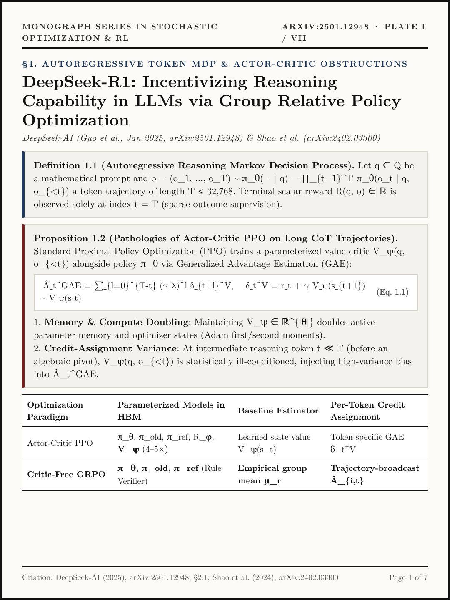
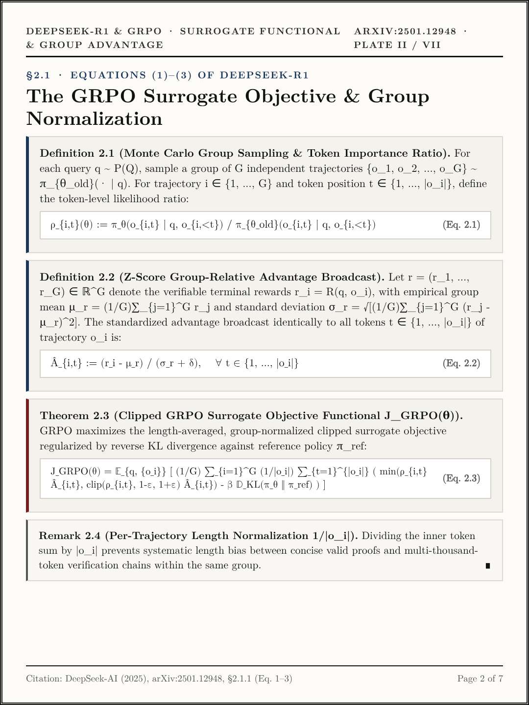
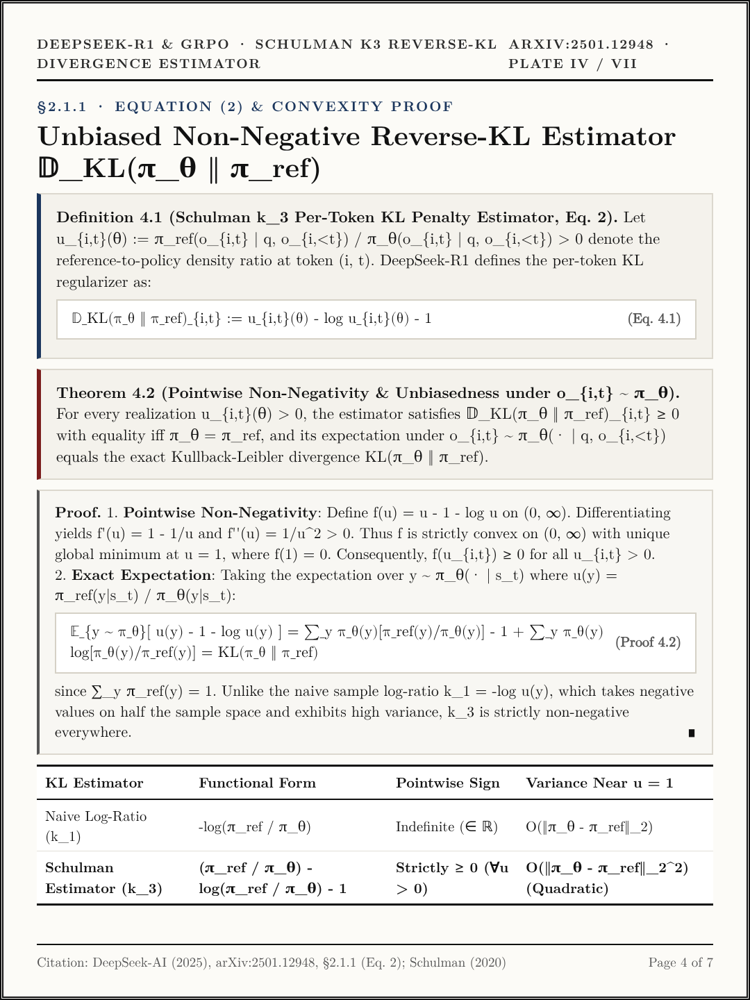
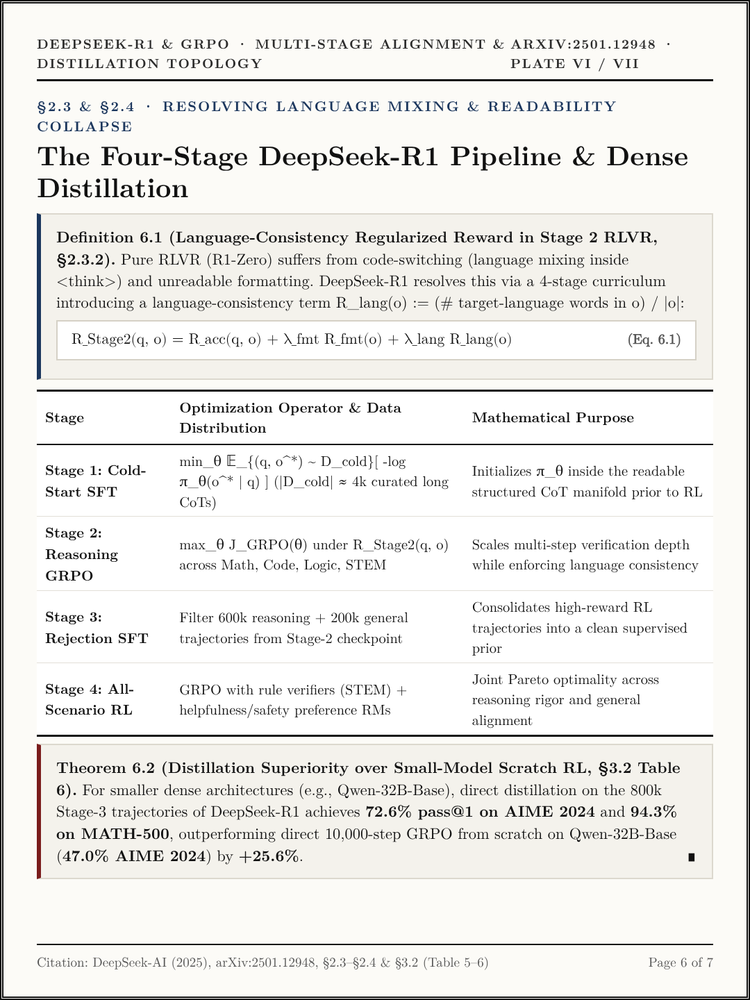
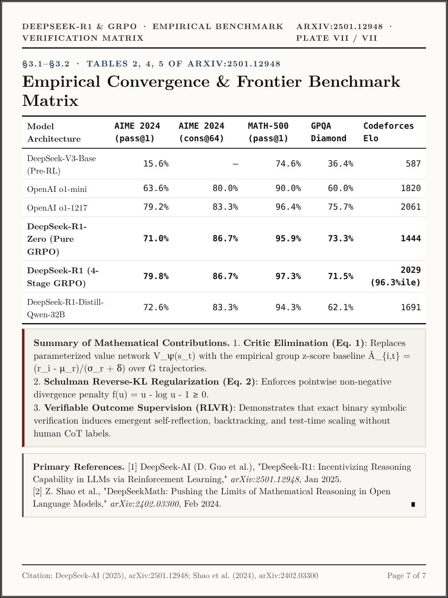

# Formal Mathematical Research Monograph Series: Foundations of Large Language Model Reasoning, Optimization, and Systems

> **Interactive Mathematical Monograph Reader (GitHub Pages)**: [https://kunruiw1991.github.io/rednote-llm-paper-summary/](https://kunruiw1991.github.io/rednote-llm-paper-summary/)

A rigorous, theorem-proof mathematical compendium of foundational and frontier **Large Language Model (LLM)** research papers. Each volume is structured as a **7-Plate Formal Mathematical Monograph** (`1080×1440 px` archival plates typeset in Computer Modern / Bourbaki *Definition–Proposition–Theorem–Proof* style) with complete probability space specifications, hypergeometric and variational derivations, complexity bounds, and empirical calibration matrices.

---

## 1. Monograph Curriculum & Volume Index (`Tracks A → B → C → D`)

| Volume | Track | Primary Reference & Citation | Formal Mathematical Scope | Monograph Plates (`1080×1440`) | Interactive Reader |
| :--- | :--- | :--- | :--- | :---: | :---: |
| **Vol. I** (`ep01`) | **Track A: Multi-Agent Reasoning & Proof Harnesses** | H. Lin, D. P. Woodruff, Y. Deng, J. Mao, S. Zuo, V. Mirrokni, *"Stellar Colosseum: A Many-Agent Harness for Long-Horizon Research in Mathematics and Theoretical Computer Science,"* [arXiv:2609.15983v2](https://arxiv.org/abs/2609.15983v2) (Sept 2026) | Typed `StrategyCard` automata, 4-way Readiness Gate partition, hypergeometric reuse `E[R_i^(ℓ)] = m_{ℓ+1} k_ℓ / m_ℓ` (Eq. 1–5), topological section DAG `G=(V,E)` with global veto semantics, logistic Elo MLE (Eq. 13–14), and 7 TCS theorems (Eq. 6–12). | [Plates I–VII](episodes/ep01_stellar_colosseum/cards/) | [Open Vol. I](https://kunruiw1991.github.io/rednote-llm-paper-summary/episodes/ep01_stellar_colosseum/) |
| **Vol. II** (`ep02`) | **Track B: Stochastic Optimization & Reinforcement Learning** | DeepSeek-AI (D. Guo et al.), *"DeepSeek-R1: Incentivizing Reasoning Capability in LLMs via Reinforcement Learning,"* [arXiv:2501.12948](https://arxiv.org/abs/2501.12948) (Jan 2025); Z. Shao et al., [arXiv:2402.03300](https://arxiv.org/abs/2402.03300) | Token-level MDP formulation, critic-free GRPO surrogate functional `J_GRPO(θ)` (Eq. 1–3), empirical control-variate centering `∑ Â_{i,t} = 0`, affine reward invariance, zero-gradient saturation boundary `p(q) ∈ {0,1}`, Schulman `k_3` reverse-KL convexity proof (`u - log u - 1 ≥ 0`), and deterministic RLVR immunity to Goodhart's Law. | [Plates I–VII](episodes/ep02_deepseek_r1_grpo/cards/) | [Open Vol. II](https://kunruiw1991.github.io/rednote-llm-paper-summary/episodes/ep02_deepseek_r1_grpo/) |
| **Vol. III** (`ep03`) | **Track C: Retrieval-Augmented & Tool-Augmented Inference** | S. Yao et al., *"ReAct"* ([arXiv:2210.03629](https://arxiv.org/abs/2210.03629)); A. Asai et al., *"Self-RAG"* ([arXiv:2310.11511](https://arxiv.org/abs/2310.11511)) | POMDP formulation over external knowledge/tool state transitions and critique-token conditional decoding. | *Scheduled (Daily 2AM PT)* | *Scheduled* |
| **Vol. IV** (`ep04`) | **Track D: High-Throughput Inference & Memory Systems** | W. Kwon et al., *"Efficient Memory Management for Large Language Model Serving with PagedAttention,"* [arXiv:2309.06180](https://arxiv.org/abs/2309.06180) | Virtual block-table KV-cache paging bounds (`< 4%` internal fragmentation) and lossless speculative rejection sampling equivalence. | *Scheduled (Daily 2AM PT)* | *Scheduled* |

---

## 2. Volume I (`ep01_stellar_colosseum`): *Stellar Colosseum* ([arXiv:2609.15983v2](https://arxiv.org/abs/2609.15983v2))

### Formal Monograph Plates I–VII (`1080×1440` Archival Typesetting)

  
  
  

  
  
  

  

### Key Formal Results (Vol. I)
- **Proposition 3.2 (Expected Candidate Multiplicity, Eq. 1–5)**: Given a layer-`ℓ` population `C^(ℓ)` of cardinality `m_ℓ` and `m_{ℓ+1}` downstream synthesis nodes independently sampling subsets `G_j^(ℓ) ~ Unif{G ⊆ C^(ℓ) : |G| = k_ℓ}` without replacement (`k_ℓ = min(k, m_ℓ)`), the single-node hypergeometric inclusion probability is `C(m_ℓ - 1, k_ℓ - 1) / C(m_ℓ, k_ℓ) = k_ℓ / m_ℓ`, yielding expected candidate multiplicity `E[R_i^(ℓ)] = m_{ℓ+1} k_ℓ / m_ℓ` (`2.500` at `32 → 16, k=5`).
- **Theorem 4.2 (Two-Tier Verification & Global Veto Semantics)**: Local section failures `Φ_local(d_v) ≠ READY` trigger hermetic retries restricted to vertex `v ∈ V` while preserving upstream proofs `{d_u : (u, v) ∈ E}`. Global verification over assembled document `D = (d_1, ..., d_S)` enforces unanimous veto semantics `Accept(D) = 1 ⟺ ⋀_{j=1}^m [Defect_fatal(Φ_global^(j)(D)) = ∅]`.
- **Empirical Calibration (Eq. 13–14)**: Achieves **71.00% (`213 / 300`)** on **TCS-Bench** (FOCS/STOC/SODA 2020–2026) under cross-model critique gating (`AUC = 0.896`), and solves **218 / 222 (98.20%)** Codeforces tasks (`r_i > 1500`), corresponding to a maximum-likelihood logistic Elo rating `x̂ = 4263` (`∑_{i=1}^{222} [1 + 10^{(r_i - x̂)/400}]^{-1} = 218`).

---

## 3. Volume II (`ep02_deepseek_r1_grpo`): *DeepSeek-R1 & GRPO* ([arXiv:2501.12948](https://arxiv.org/abs/2501.12948))

### Formal Monograph Plates I–VII (`1080×1440` Archival Typesetting)

  
  
  

  
  
  

  

### Key Formal Results (Vol. II)
- **Theorem 2.3 (Clipped GRPO Surrogate Functional `J_GRPO(θ)`, Eq. 1–3)**: Eliminates the parameterized critic network `V_ψ(s_t)` by normalizing terminal rewards `r = (r_1, ..., r_G)` across `G` i.i.d. rollouts `{o_1, ..., o_G} ~ π_{θ_old}(· | q)` via `Â_{i,t} = (r_i - μ_r) / (σ_r + δ)`.
- **Proposition 3.1–3.3 (Control Variate Centering, Scale Invariance & Saturation Boundary)**: Satisfies `∑_{i=1}^G Â_{i,t} = 0` and `(1/G)∑_{i=1}^G Â_{i,t}^2 = 1`, invariance under positive affine transforms `r'_i = a r_i + b (a > 0)`, and exact gradient vanishing `∇_θ J_GRPO^surr(θ | q) = 0` whenever `p(q) ∈ {0, 1}` (`σ_r = 0`).
- **Theorem 4.2 (Schulman `k_3` Reverse-KL Estimator)**: For density ratio `u_{i,t} = π_ref / π_θ > 0`, `f(u) = u - log u - 1` satisfies `f(1) = f'(1) = 0` and `f''(u) = 1/u^2 > 0`, guaranteeing strict pointwise non-negativity `𝔻_KL(π_θ ‖ π_ref)_{i,t} ≥ 0` and unbiasedness `E_{o_{i,t} ~ π_θ}[f(u_{i,t})] = KL(π_θ ‖ π_ref)`.
