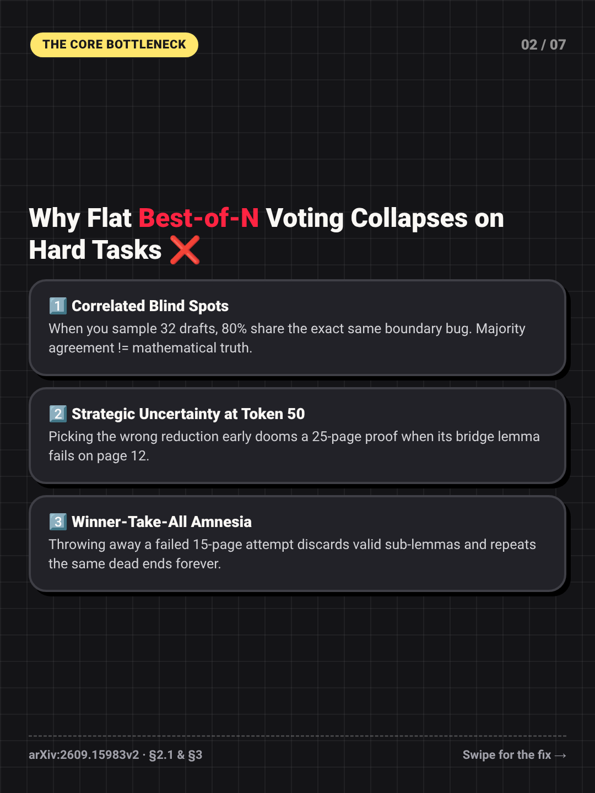
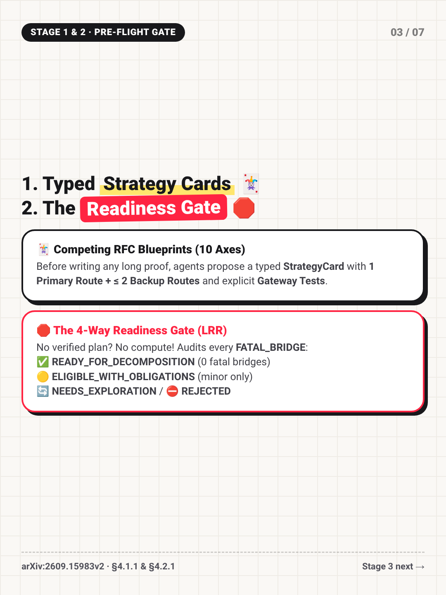
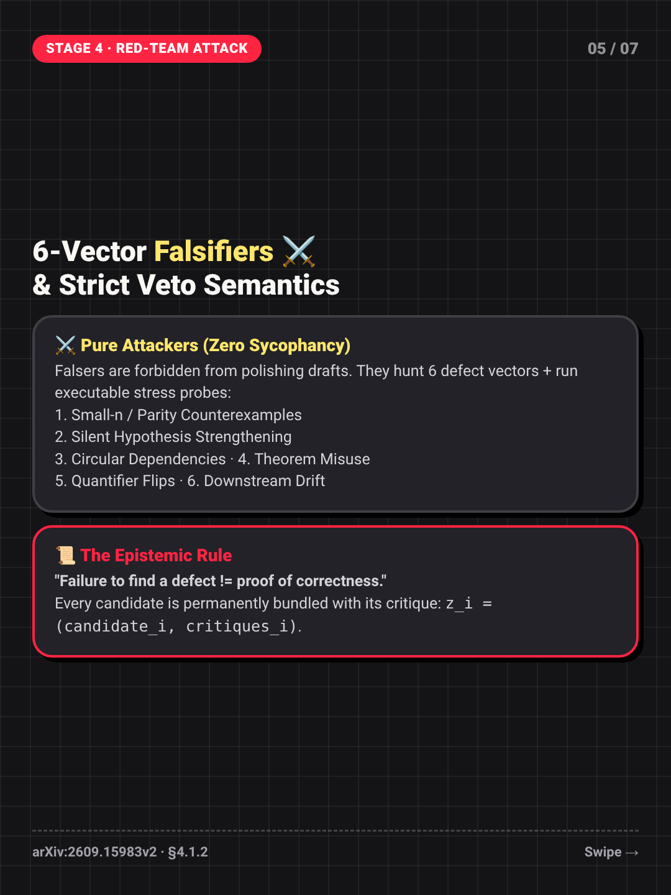
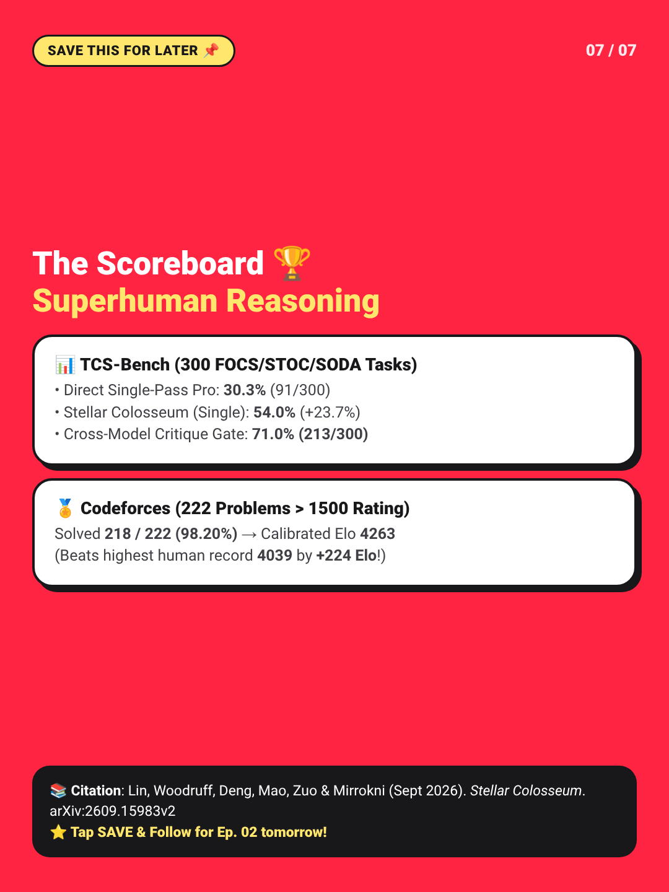

# 📕 RedNote (3:4) Daily LLM Paper Reading Cards & Mobile Studio

> **Live Interactive RedNote 3:4 Mobile Simulator (GitHub Pages)**: [https://kunruiw1991.github.io/rednote-llm-paper-summary/](https://kunruiw1991.github.io/rednote-llm-paper-summary/)

A curated daily series of foundational and frontier **Large Language Model (LLM)** paper breakdowns formatted specifically as **RedNote (3:4 / `1080×1440 px`) swipeable visual cards** (iPad GoodNotes grid paper + dark Bento boxes + highlighter accents, `< 45 words/card`) paired with aerated 1-sentence-per-line mobile captions and complete public academic citations.

---

## 🧭 Rotating 4-Track Daily Curriculum (`A → B → C → D`)

| Episode | Track | Public Paper & Citation | 3:4 Card Deck | Interactive Studio |
| :--- | :--- | :--- | :---: | :---: |
| **Ep. 01** | **Track A: Reasoning & Agent Harnesses** | **Stellar Colosseum**: *A Many-Agent Harness for Long-Horizon Research in Mathematics and Theoretical Computer Science* — Lin, Woodruff, Deng, Mao, Zuo, Mirrokni (Sept 2026) · [arXiv:2609.15983v2](https://arxiv.org/abs/2609.15983v2) | [📂 7 Cards (`1080×1440`)](episodes/ep01_stellar_colosseum/cards/) | [📱 Open Studio](https://kunruiw1991.github.io/rednote-llm-paper-summary/episodes/ep01_stellar_colosseum/) |
| **Ep. 02** *(Upcoming)* | **Track B: Post-Training & RL** | **DeepSeek-R1**: *Incentivizing Reasoning Capability in LLMs via Reinforcement Learning (GRPO)* · [arXiv:2501.12948](https://arxiv.org/abs/2501.12948) | *Scheduled (Daily 2AM PT)* | *Scheduled* |
| **Ep. 03** *(Upcoming)* | **Track C: RAG & Tool Use** | **ReAct & Self-RAG**: *Synergizing Reasoning and Acting + Self-Reflective Retrieval-Augmented Generation* · [arXiv:2210.03629](https://arxiv.org/abs/2210.03629) / [arXiv:2310.11511](https://arxiv.org/abs/2310.11511) | *Scheduled (Daily 2AM PT)* | *Scheduled* |
| **Ep. 04** *(Upcoming)* | **Track D: Fast Inference & Systems** | **vLLM PagedAttention & Speculative Decoding**: *Efficient Memory Management for LLM Serving* · [arXiv:2309.06180](https://arxiv.org/abs/2309.06180) | *Scheduled (Daily 2AM PT)* | *Scheduled* |

---

## 🎴 Episode 01: *Stellar Colosseum* ([arXiv:2609.15983v2](https://arxiv.org/abs/2609.15983v2)) — 7-Card 3:4 Deck

<p align="center">
  
  
  
</p>
<p align="center">
  
  
  
</p>
<p align="center">
  
</p>

---

## 📱 Copy-Paste RedNote Mobile Caption (Ep. 01)

```text
Are flat AI Agent teams BROKEN? 🤯 I read the 75-page Stellar Colosseum paper so you don't have to! ☕️✨

Ever run 32 parallel LLM agents ("Battle-of-N") only to watch all 32 agree on the exact same subtle boundary bug? 😭

Mode collapse is real. Majority voting does NOT equal mathematical truth. 📉

Enter: Stellar Colosseum (arXiv:2609.15983v2) by Honghao Lin, David P. Woodruff, Yuan Deng, Jieming Mao, Song Zuo & Vahab Mirrokni (Sept 2026). 🏛️

Instead of flat generation + majority voting, it wraps LLMs in a 2-level adversarial research organization.

Swipe the 3:4 cards above to steal the blueprint! 👉

Slide 2 👉 Why flat Best-of-N fails (Correlated blind spots & strategic collapse)
Slide 3 👉 Stage 1 & 2: Typed Strategy Cards + The 4-Way Readiness Gate 🛑
Slide 4 👉 Stage 3: Topological Section DAG (Surgical local retries like Bazel! 🧩)
Slide 5 👉 Stage 4: 6-Vector Red-Team Falsifiers ("No bug found != proof of correctness" ⚔️)
Slide 6 👉 Stage 5: Overlapping Tree Synthesis (2.5x reuse per layer) + The Graveyard 🪦
Slide 7 👉 The Scoreboard: 71.0% on TCS-Bench & 4263 Codeforces Elo (+224 above the 4039 human world record!) 🏆

📚 Public Paper Citation:
Lin, H., Woodruff, D. P., Deng, Y., Mao, J., Zuo, S., & Mirrokni, V. (2026). "Stellar Colosseum: A Many-Agent Harness for Long-Horizon Research in Mathematics and Theoretical Computer Science." arXiv:2609.15983v2 (https://arxiv.org/abs/2609.15983v2)

Which mechanism are you adding to your agent harness first: the Readiness Gate or the Failed-Approaches Graveyard? 👇💬

📌 SAVE this cheat sheet for your next AI architecture review! ✨

#LLMPaperReading #AIAgents #StellarColosseum #MultiAgentSystems #MachineLearning #ArXivDaily #CodingLife #TechNotes
```
