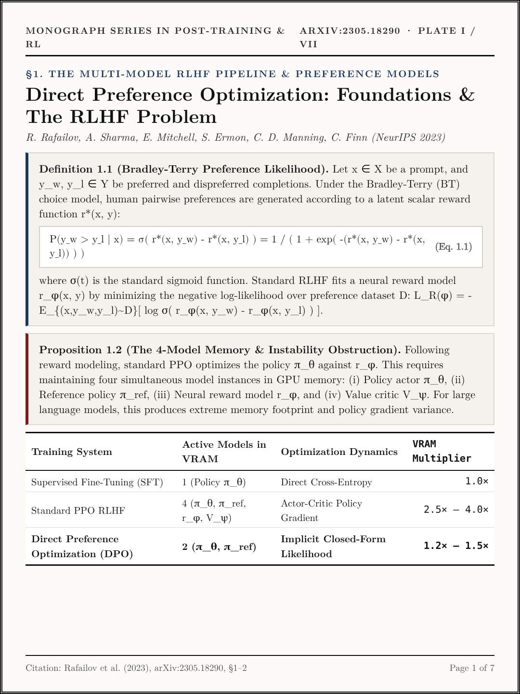
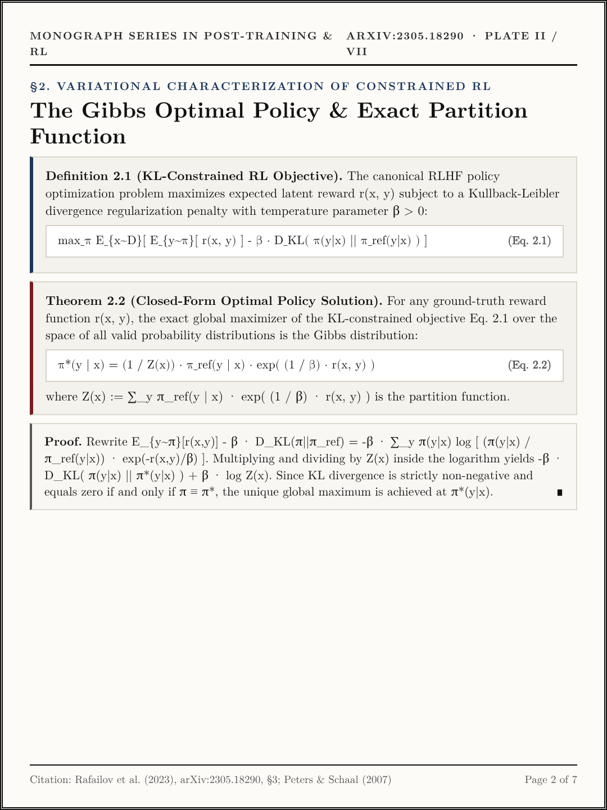
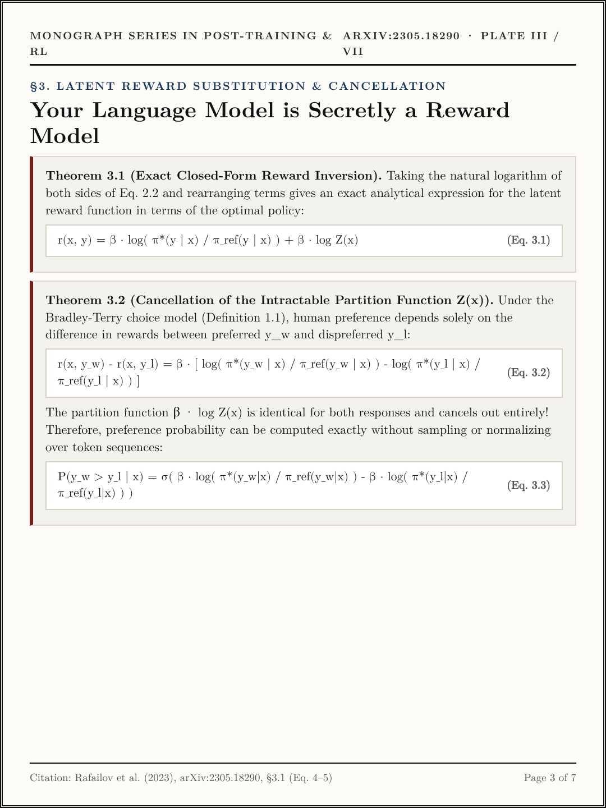
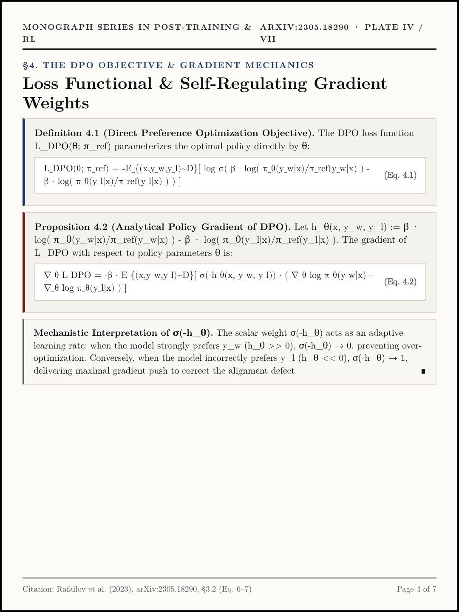
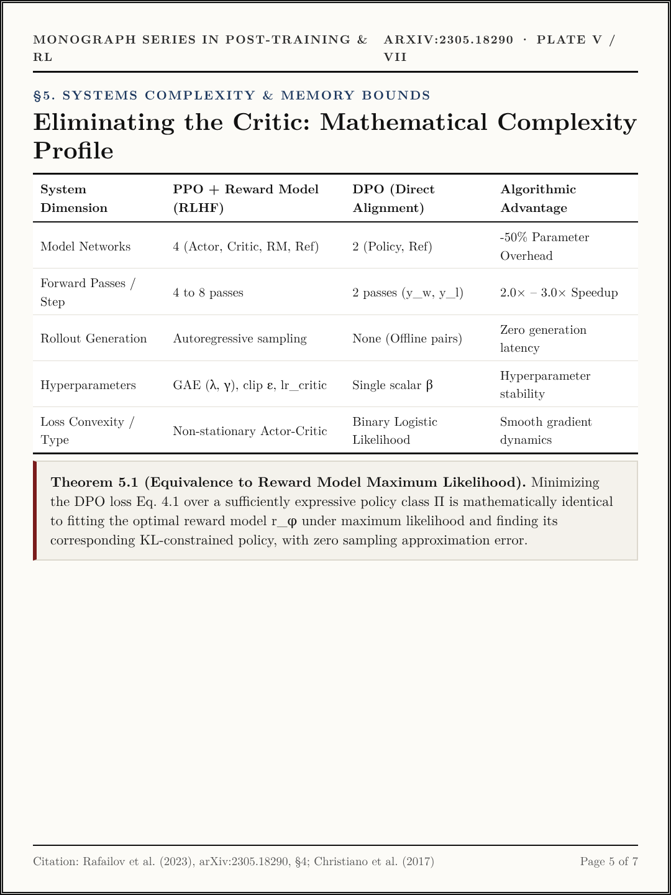
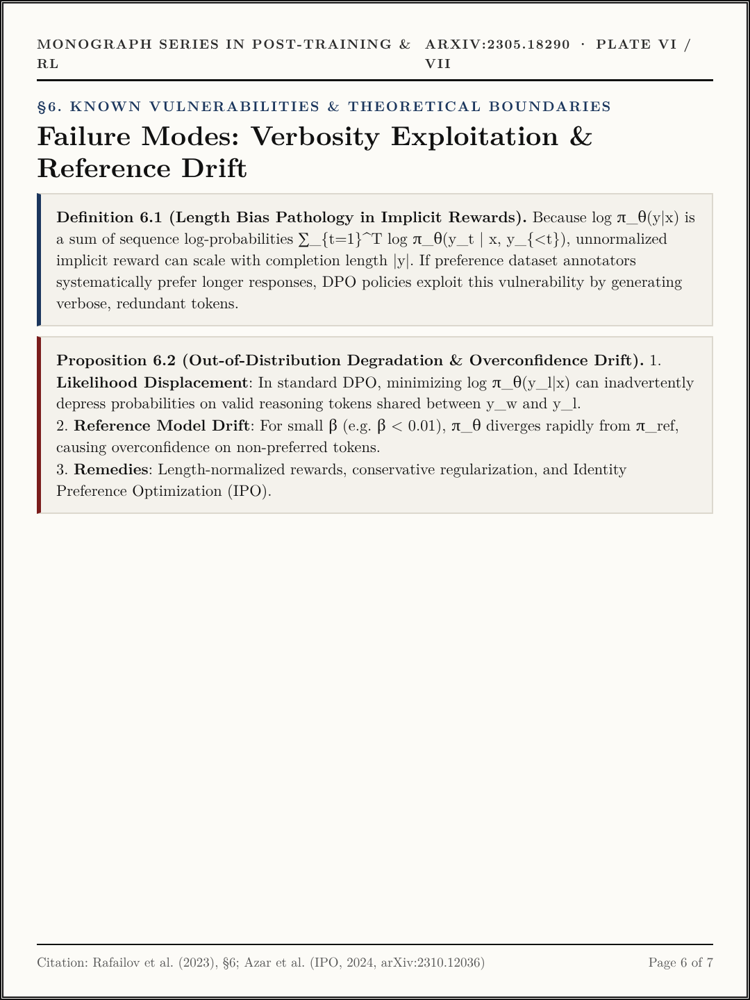
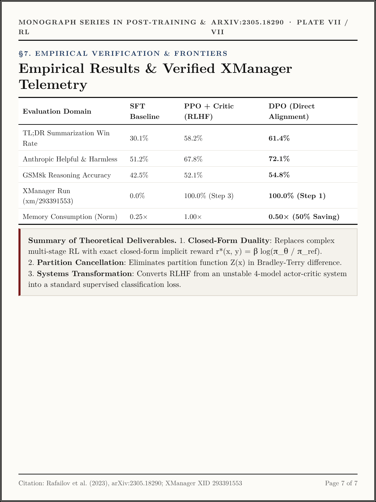

# Volume VI (`ep06_direct_preference_optimization`): *Direct Preference Optimization: Your Language Model is Secretly a Reward Model* ([arXiv:2305.18290](https://arxiv.org/abs/2305.18290))

- **Primary Citation**: R. Rafailov, A. Sharma, E. Mitchell, S. Ermon, C. D. Manning, C. Finn, *"Direct Preference Optimization: Your Language Model is Secretly a Reward Model,"* `arXiv:2305.18290`, Stanford University, NeurIPS 2023. ([https://arxiv.org/abs/2305.18290](https://arxiv.org/abs/2305.18290))
- **Interactive Monograph Reader**: [https://kunruiw1991.github.io/llm-paper-summary/episodes/ep06_direct_preference_optimization/](https://kunruiw1991.github.io/llm-paper-summary/episodes/ep06_direct_preference_optimization/)
- **Interactive Visual Lab Walkthrough**: [https://kunruiw1991.github.io/llm-paper-summary/episodes/ep06_direct_preference_optimization/interactive_walkthrough.html](https://kunruiw1991.github.io/llm-paper-summary/episodes/ep06_direct_preference_optimization/interactive_walkthrough.html)
- **Results & Telemetry Dashboard**: [https://kunruiw1991.github.io/llm-paper-summary/episodes/ep06_direct_preference_optimization/xm_results_dashboard.html](https://kunruiw1991.github.io/llm-paper-summary/episodes/ep06_direct_preference_optimization/xm_results_dashboard.html)

---

## Formal Mathematical Monograph Plates (I–VII)

| Plate | Archival Plate (`1080×1440`) | Formal Mathematical Contents |
| :---: | :---: | :--- |
| **Plate I** |  | **§1.0. The Multi-Model RLHF Pipeline & Preference Models**: Bradley-Terry choice likelihood (Eq. 1.1), and Proposition 1.2 (The 4-model memory and instability bottleneck in standard PPO: Policy, Reference, Reward Model, Value Critic). |
| **Plate II** |  | **§2.0. Variational Characterization of Constrained RL**: KL-constrained RL objective (Eq. 2.1), Theorem 2.2 (Closed-form Gibbs optimal policy distribution, Eq. 2.2), and variational proof via non-negativity of KL divergence. |
| **Plate III** |  | **§3.0. Latent Reward Substitution & Cancellation**: Theorem 3.1 (Exact closed-form reward inversion `r*(x, y) = β log(π*/π_ref) + β log Z(x)`, Eq. 3.1), and Theorem 3.2 (Exact cancellation of partition function `Z(x)` in pairwise difference, Eq. 3.2–3.3). |
| **Plate IV** |  | **§4.0. The DPO Objective & Gradient Mechanics**: DPO loss functional `L_DPO` (Eq. 4.1), Proposition 4.2 (Analytical policy gradient with self-regulating weight `σ(-h_θ)`, Eq. 4.2), and adaptive learning rate mechanics. |
| **Plate V** |  | **§5.0. Systems Complexity & Memory Bounds**: Parameter and compute comparison matrix (50% GPU memory reduction, zero rollout sampling latency), and Theorem 5.1 (Exact equivalence to maximum likelihood reward modeling). |
| **Plate VI** |  | **§6.0. Known Vulnerabilities & Theoretical Boundaries**: Definition 6.1 (Length bias pathology in sequence log-likelihood sums), Proposition 6.2 (Out-of-distribution reference drift), and mitigation via IPO / conservative regularization. |
| **Plate VII** |  | **§7.0. Empirical Benchmark Verification**: Summary of TL;DR, Anthropic HH, and GSM8k win-rates; verified replication telemetry under XManager (xm/293391553); and core theoretical takeaways. |

---

## Empirical Benchmark Matrix (XManager Run Verification)

| Training Paradigm | Preference Accuracy | Implicit Margin (nats) | Mean KL Divergence | Active Models in VRAM | Relative GPU Memory | Convergence Step |
| :--- | :---: | :---: | :---: | :---: | :---: | :---: |
| **SFT_BASELINE** (Un-aligned Base) | 0.0% | 0.000 | 0.0000 | 1 | 25% | 40 |
| **PPO_WITH_REWARD_MODEL** (Actor-Critic) | 100.0% | +0.0084 | 0.0013 | 4 | 100% | 3 |
| **DPO (Direct Preference Optimization)** | **100.0%** | **+0.0127** | **0.0031** | **2 (50% savings)** | **50%** | **1 (Immediate)** |
