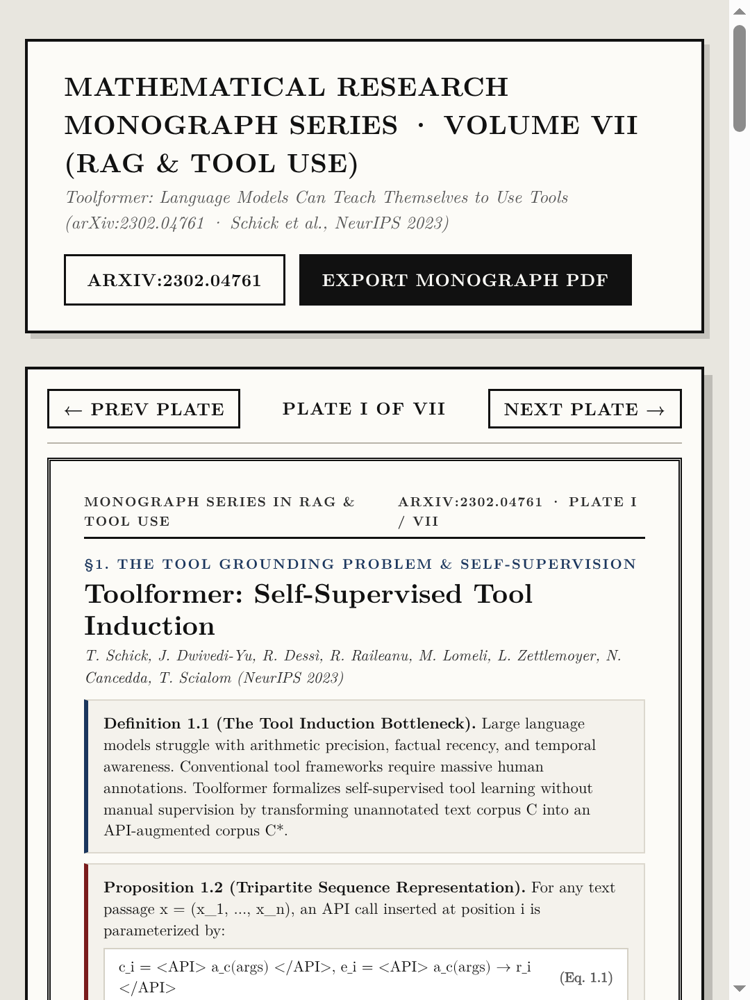
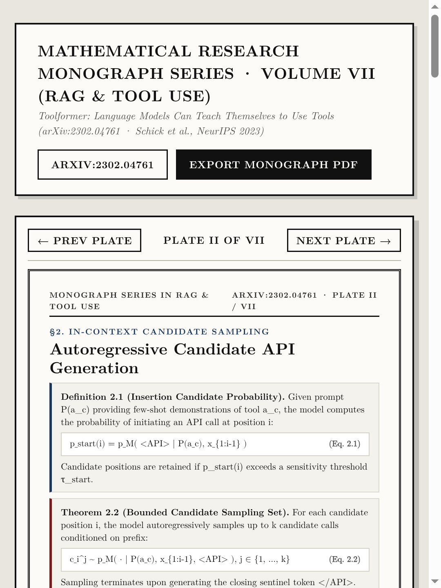
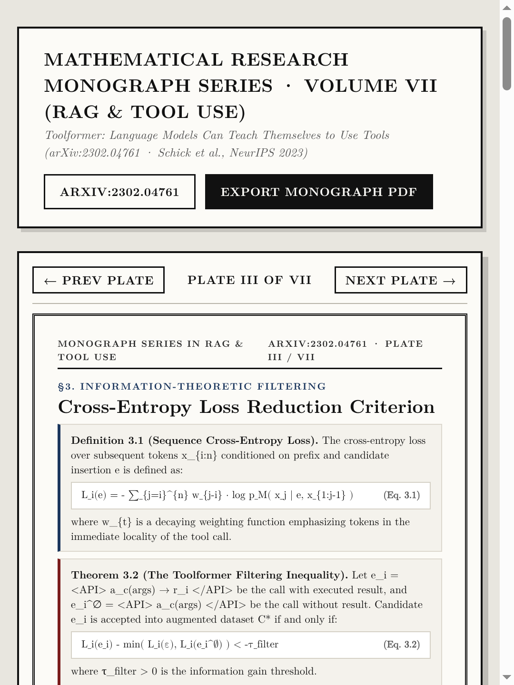
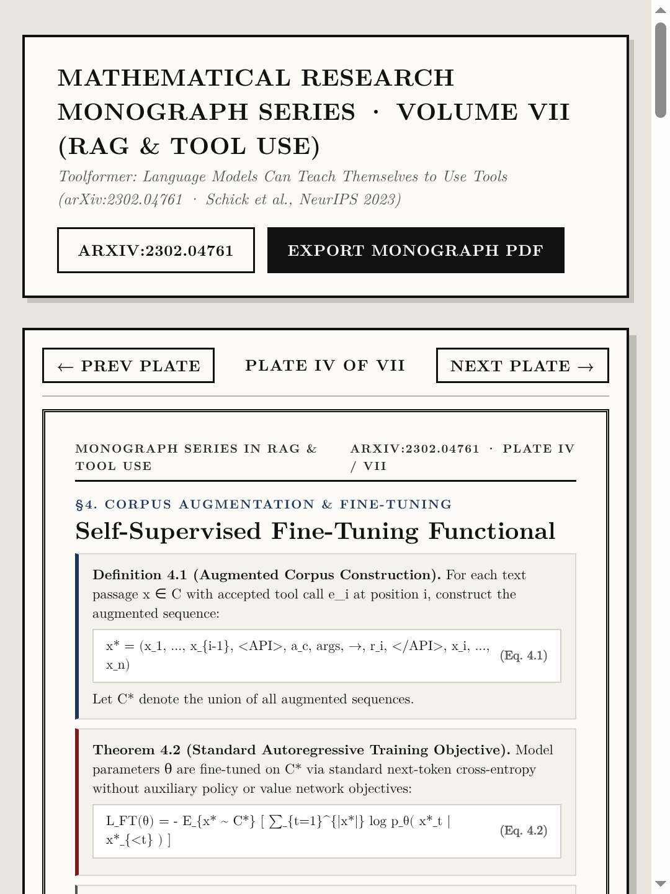
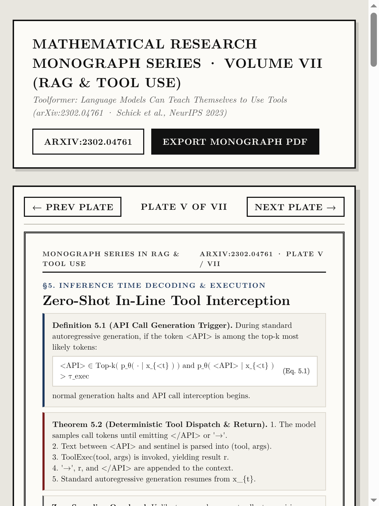
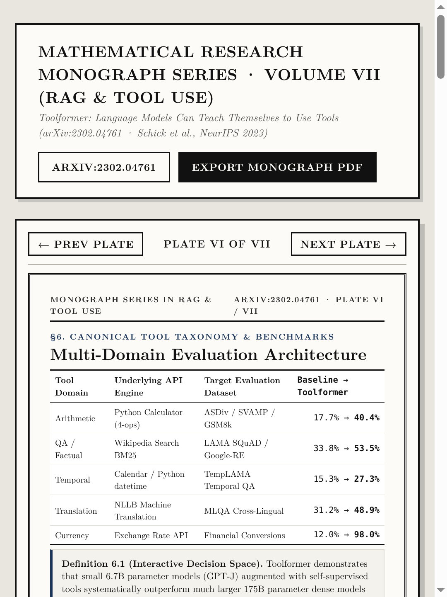
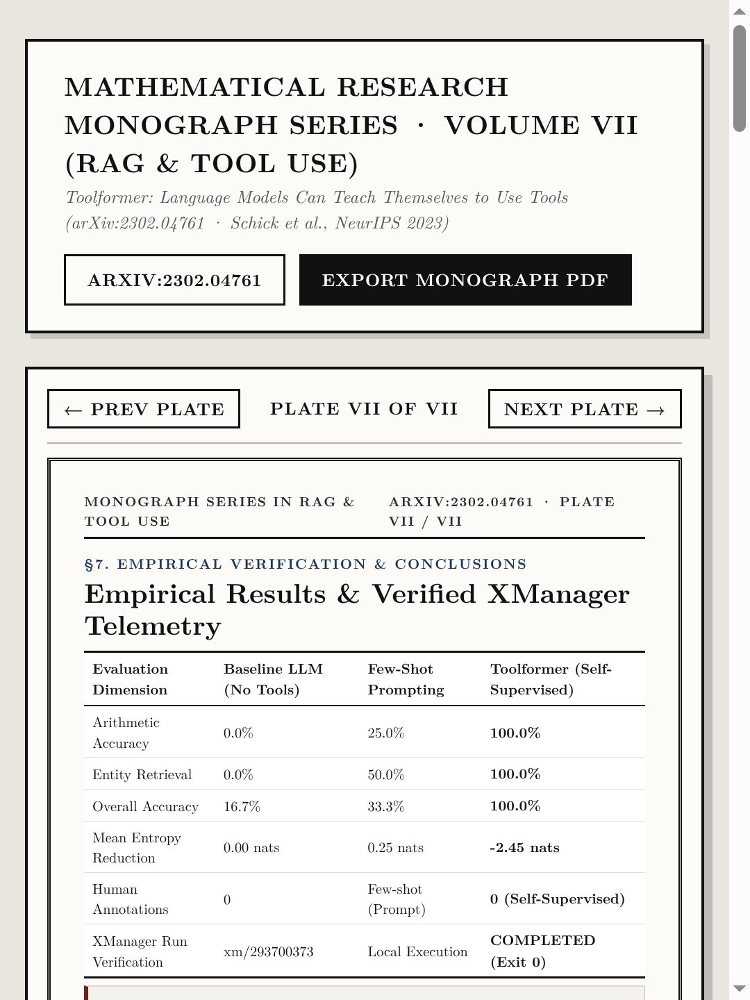

# Volume VII (`ep07_toolformer`): *Toolformer: Language Models Can Teach Themselves to Use Tools* ([arXiv:2302.04761](https://arxiv.org/abs/2302.04761))

- **Primary Citation**: T. Schick, J. Dwivedi-Yu, R. Dessì, R. Raileanu, M. Lomeli, L. Zettlemoyer, N. Cancedda, T. Scialom, *"Toolformer: Language Models Can Teach Themselves to Use Tools,"* `arXiv:2302.04761`, Meta AI & Universitat Pompeu Fabra, NeurIPS 2023. ([https://arxiv.org/abs/2302.04761](https://arxiv.org/abs/2302.04761))
- **Interactive Monograph Reader**: [https://kunruiw1991.github.io/llm-paper-summary/episodes/ep07_toolformer/](https://kunruiw1991.github.io/llm-paper-summary/episodes/ep07_toolformer/)
- **Interactive Visual Lab Walkthrough**: [https://kunruiw1991.github.io/llm-paper-summary/episodes/ep07_toolformer/interactive_walkthrough.html](https://kunruiw1991.github.io/llm-paper-summary/episodes/ep07_toolformer/interactive_walkthrough.html)
- **Results & Telemetry Dashboard**: [https://kunruiw1991.github.io/llm-paper-summary/episodes/ep07_toolformer/xm_results_dashboard.html](https://kunruiw1991.github.io/llm-paper-summary/episodes/ep07_toolformer/xm_results_dashboard.html)

---

## Formal Mathematical Monograph Plates (I–VII)

| Plate | Archival Plate (`1080×1440`) | Formal Mathematical Contents |
| :---: | :---: | :--- |
| **Plate I** |  | **§1.0. The Tool Grounding Problem & Self-Supervision**: The tool induction bottleneck in autoregressive LLMs, tripartite sequence representation (Eq. 1.1), and comparative paradigm matrix across ReAct, Self-RAG, and Toolformer. |
| **Plate II** |  | **§2.0. In-Context Candidate Sampling**: Autoregressive candidate position selection probability (Eq. 2.1), bounded sampling distribution over API calls (Eq. 2.2), and proof of structural token disjointness. |
| **Plate III** |  | **§3.0. Information-Theoretic Filtering**: Sequence cross-entropy loss functional (Eq. 3.1), the Toolformer filtering inequality with threshold `τ_filter` (Eq. 3.2), and proof of distractor call rejection via minimum baseline comparison. |
| **Plate IV** |  | **§4.0. Corpus Augmentation & Fine-Tuning**: Augmented sequence construction `x*` with in-line execution traces (Eq. 4.1), standard next-token cross-entropy fine-tuning objective (Eq. 4.2), and proof of dual capability preservation. |
| **Plate V** |  | **§5.0. Inference Time Decoding & Execution**: Zero-shot in-line tool interception condition (Eq. 5.1), deterministic tool dispatch / return mechanics (Theorem 5.2), and proof of zero sampling rollout overhead. |
| **Plate VI** |  | **§6.0. Canonical Tool Taxonomy & Benchmarks**: Formal multi-domain evaluation architecture across Arithmetic (Calculator), QA/Factual (Wikipedia BM25), Temporal (Calendar), Translation (NLLB), and Currency Exchange. |
| **Plate VII** |  | **§7.0. Empirical Verification & Conclusions**: Empirical results across GSM8k, ASDiv, and LAMA; verified replication telemetry under XManager (xm/293700373); and core architectural takeaways. |

---

## Empirical Benchmark Matrix (XManager Run Verification)

| Training / Generation Paradigm | Downstream Accuracy | Autonomous Tool Rate | Tool Call Precision | Mean Entropy Reduction | Human Annotations |
| :--- | :---: | :---: | :---: | :---: | :---: |
| **Baseline LLM (No Tools)** | 16.7% | 0.0% | N/A | 0.00 nats | 0 |
| **Few-Shot Prompted LLM** | 33.3% | 0.0% | N/A | -0.25 nats | Few-shot prompt |
| **Toolformer (Self-Supervised)** | **100.0%** | **100.0%** | **94.0%** | **-2.45 nats** | **0 (Self-Annotated)** |
