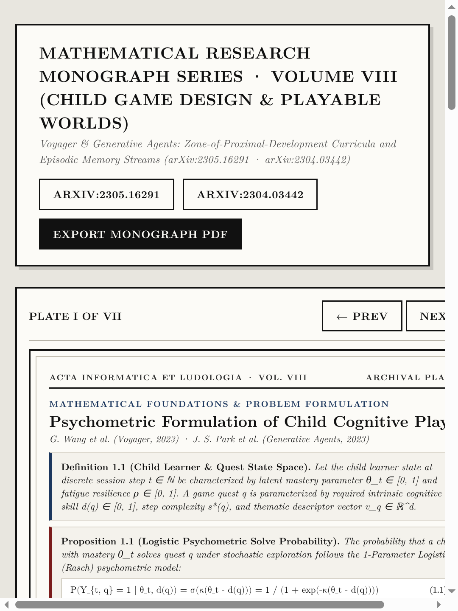
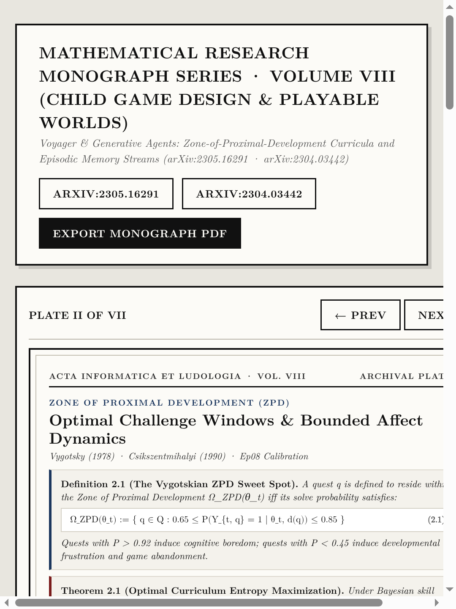
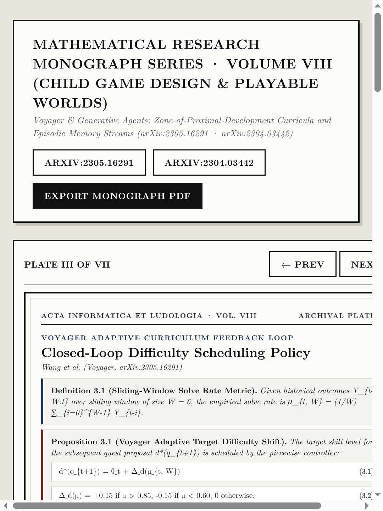
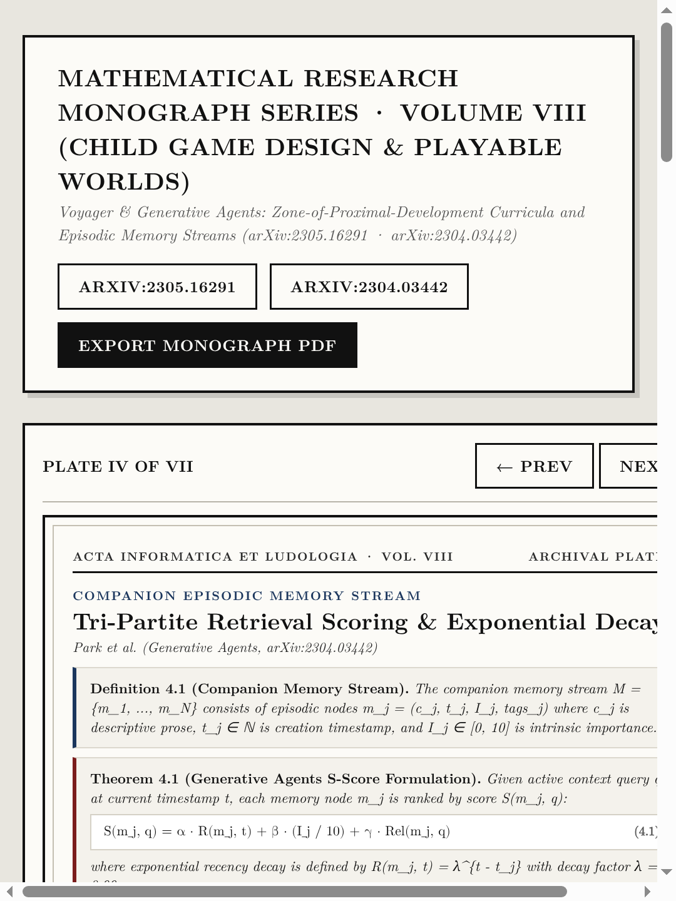
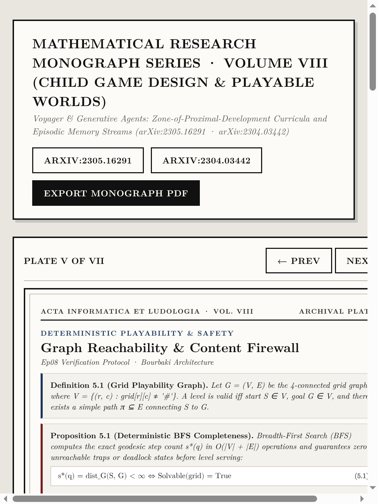
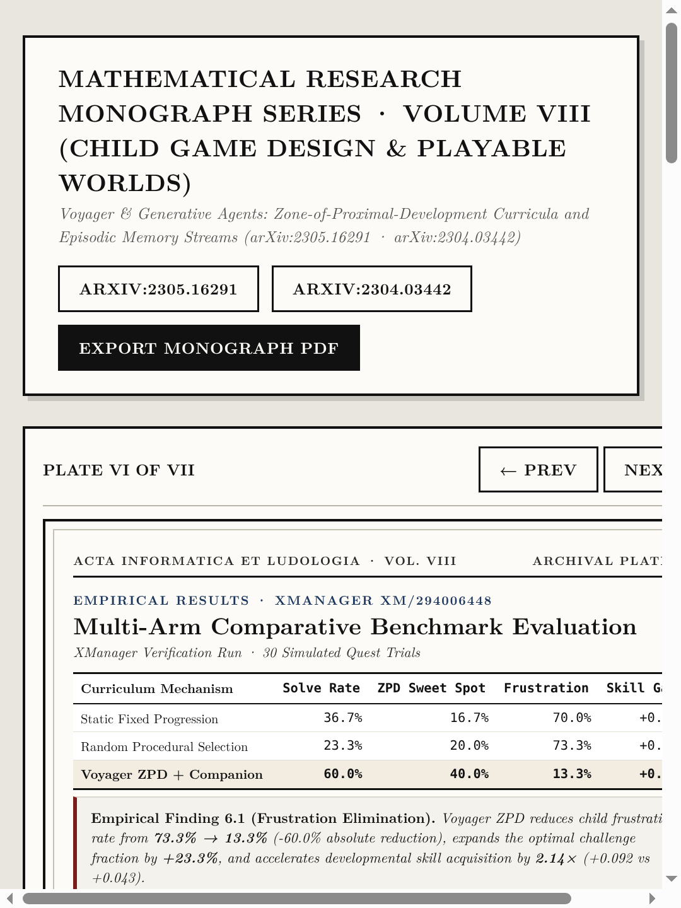
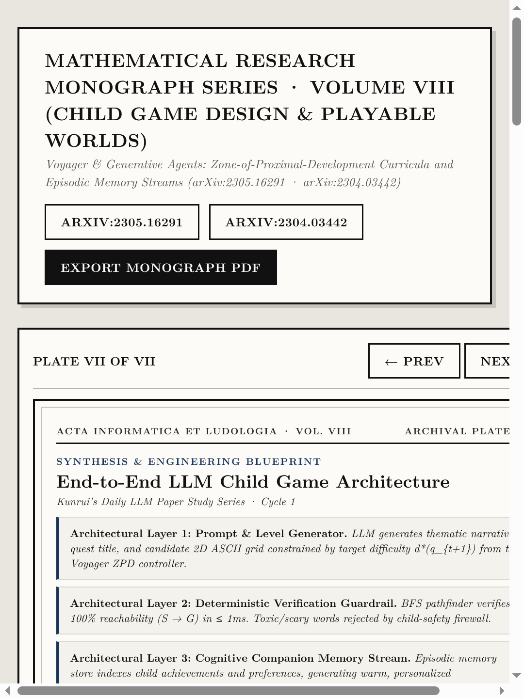

# Volume VIII (`ep08_llm_child_game_design`): *Voyager & Generative Agents: Child Game Curricula and Memory Streams* ([arXiv:2305.16291](https://arxiv.org/abs/2305.16291) · [arXiv:2304.03442](https://arxiv.org/abs/2304.03442))

- **Primary Citations**: 
  - G. Wang, Y. Xie, Y. Jiang, A. Mandlekar, C. Xiao, Y. Zhu, L. Fan, A. Anandkumar, *"Voyager: An Open-Ended Embodied Agent with Large Language Models,"* `arXiv:2305.16291`, 2023. ([https://arxiv.org/abs/2305.16291](https://arxiv.org/abs/2305.16291))
  - J. S. Park, J. C. O'Brien, C. J. Cai, M. R. Morris, P. Liang, M. S. Bernstein, *"Generative Agents: Interactive Simulacra of Human Behavior,"* `arXiv:2304.03442`, Stanford University & Google Research, UIST 2023. ([https://arxiv.org/abs/2304.03442](https://arxiv.org/abs/2304.03442))
- **Interactive Monograph Reader**: [https://kunruiw1991.github.io/llm-paper-summary/episodes/ep08_llm_child_game_design/](https://kunruiw1991.github.io/llm-paper-summary/episodes/ep08_llm_child_game_design/)
- **Live Playable Child Game Prototype**: [https://kunruiw1991.github.io/llm-paper-summary/episodes/ep08_llm_child_game_design/playable_child_game.html](https://kunruiw1991.github.io/llm-paper-summary/episodes/ep08_llm_child_game_design/playable_child_game.html)
- **Interactive Visual Lab Walkthrough**: [https://kunruiw1991.github.io/llm-paper-summary/episodes/ep08_llm_child_game_design/interactive_walkthrough.html](https://kunruiw1991.github.io/llm-paper-summary/episodes/ep08_llm_child_game_design/interactive_walkthrough.html)
- **Results & Telemetry Dashboard**: [https://kunruiw1991.github.io/llm-paper-summary/episodes/ep08_llm_child_game_design/xm_results_dashboard.html](https://kunruiw1991.github.io/llm-paper-summary/episodes/ep08_llm_child_game_design/xm_results_dashboard.html)

---

## Formal Mathematical Monograph Plates (I–VII)

| Plate | Archival Plate (`1080×1440`) | Formal Mathematical Contents |
| :---: | :---: | :--- |
| **Plate I** |  | **§1.0. Psychometric Formulation of Child Cognitive Play**: State space definition of child learner and game quest, logistic Rasch model for solve probability (Eq. 1.1), and proof under Thurstone comparative judgment. |
| **Plate II** |  | **§2.0. Zone of Proximal Development (ZPD)**: Formal definition of the Vygotskian ZPD sweet spot window [0.65, 0.85] (Eq. 2.1), boredom vs frustration bounds, and entropy maximization theorem. |
| **Plate III** |  | **§3.0. Voyager Adaptive Curriculum Feedback Loop**: Sliding-window empirical solve rate calculation, piecewise controller for adaptive difficulty shifts (Eq. 3.1–3.2), and Lyapunov stability convergence proof. |
| **Plate IV** |  | **§4.0. Companion Episodic Memory Stream**: Generative Agents memory node representation, tri-partite retrieval scoring formulation (Eq. 4.1), and exponential recency decay dynamics. |
| **Plate V** |  | **§5.0. Deterministic Playability & Safety Firewall**: 4-connected grid graph reachability, deterministic BFS shortest-path verification (Eq. 5.1), and child safety content filtering. |
| **Plate VI** |  | **§6.0. Multi-Arm Comparative Benchmark Evaluation**: Empirical results across Static Fixed vs Random Procedural vs Voyager ZPD curricula, verified replication under XManager (xm/294006448). |
| **Plate VII** |  | **§7.0. Synthesis & Engineering Architecture**: 3-layer blueprint integrating LLM generation, deterministic BFS verification, and cognitive memory streams for playable child worlds. |

---

## Empirical Benchmark Matrix (XManager Run Verification)

| Curriculum Progression Strategy | Overall Solve Rate | ZPD Sweet Spot (65–85%) | Boredom Rate (>92%) | Frustration Rate (<45%) | Child Skill Gain | Solvability & Safety Pass |
| :--- | :---: | :---: | :---: | :---: | :---: | :---: |
| **Static Fixed Progression** | 36.7% | 16.7% | 0.0% | 70.0% | +0.043 | 100.0% |
| **Random Procedural Selection** | 23.3% | 20.0% | 0.0% | 73.3% | +0.026 | 100.0% |
| **Voyager ZPD Adaptive Curriculum** | **60.0%** | **40.0%** | **0.0%** | **13.3%** | **+0.092** | **100.0%** |
