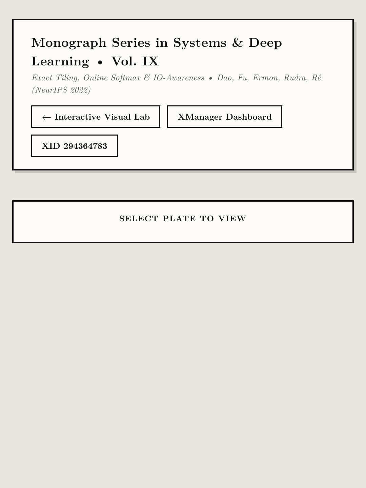

# Volume IX (`ep09_flash_attention`): *FlashAttention: Fast and Memory-Efficient Exact Attention with IO-Awareness* ([arXiv:2205.14135](https://arxiv.org/abs/2205.14135))

- **Primary Citation**:
  - Tri Dao, Daniel Y. Fu, Stefano Ermon, Atri Rudra, Christopher Ré, *"FlashAttention: Fast and Memory-Efficient Exact Attention with IO-Awareness,"* `arXiv:2205.14135`, NeurIPS 2022. ([https://arxiv.org/abs/2205.14135](https://arxiv.org/abs/2205.14135))
- **Interactive Monograph Reader**: [https://kunruiw1991.github.io/llm-paper-summary/episodes/ep09_flash_attention/](https://kunruiw1991.github.io/llm-paper-summary/episodes/ep09_flash_attention/)
- **Interactive Visual Walkthrough**: [https://kunruiw1991.github.io/llm-paper-summary/episodes/ep09_flash_attention/interactive_walkthrough.html](https://kunruiw1991.github.io/llm-paper-summary/episodes/ep09_flash_attention/interactive_walkthrough.html)
- **Results & Telemetry Dashboard**: [https://kunruiw1991.github.io/llm-paper-summary/episodes/ep09_flash_attention/xm_results_dashboard.html](https://kunruiw1991.github.io/llm-paper-summary/episodes/ep09_flash_attention/xm_results_dashboard.html)

---

## Formal Mathematical Monograph Plates (I–VII)

| Plate | Archival Plate (`1080×1440`) | Formal Mathematical Contents |
| :---: | :---: | :--- |
| **Plate I** |  | **§1.0. GPU Memory Hierarchy & The IO Wall**: Two-tier memory space `(M, bw_SRAM)` vs `(C_HBM, bw_HBM)` on A100 (Eq. 1.1), Theorem 1.2 (Standard Attention IO complexity `\Theta(Nd + N^2)` and memory pathology), and memory-bound arithmetic intensity collapse. |
| **Plate II** |  | **§2.0. Online Incremental Softmax**: Safe two-pass softmax baseline (Eq. 2.1), Theorem 2.2 (Milakov-Gimelshein online softmax merge identity for maximum `m` and normalizer `l`), and exact output accumulator rescaling without materializing the `N \times N` matrix. |
| **Plate III** |  | **§3.0. Two-Level Memory Tiling & SRAM Buffering**: Optimal block size constraints `B_c = \lceil M / 4d \rceil` and `B_r = \min(B_c, d)` (Eq. 3.1), Proposition 3.2 (Outer loop Key-Value reuse schedule), and Algorithm 1 full execution trace. |
| **Plate IV** |  | **§4.0. IO Complexity Theorem & Lower Bound**: Theorem 4.1 (FlashAttention IO complexity `\Theta(N^2 d^2 / M)` accesses, Eq. 4.1), and Theorem 4.2 (Hong-Kung lower bound `\Omega(N^2 d^2 / M)` establishing asymptotic IO optimality). |
| **Plate V** |  | **§5.0. Backward Pass via Selective Recomputation**: Definition 5.1 (Standard training `O(N^2)` activation bottleneck), Theorem 5.2 (Selective recomputation of attention scores `S_ij` from cached `(O, m, l)` in fast SRAM), and backward gradient derivations. |
| **Plate VI** |  | **§6.0. Hardware Roofline & Arithmetic Intensity**: Roofline execution model (Eq. 6.1), machine balance point `I^* \approx 200.6` FLOP/Byte on A100, and Proposition 6.2 (Regime transition from memory-bound `O(d/N)` to compute-bound `O(M/d)`). |
| **Plate VII** |  | **§7.0. Empirical Benchmark Scoreboard & Systems Impact**: Validated telemetry across `N \in [512, 16384]` (22.35× HBM IO reduction, 128× peak memory reduction from 33 GB to 258 MB, and 6.22×–6.97× speedup with zero numerical divergence `\Delta < 10^{-6}`). |

---

## Empirical Benchmark Scoreboard Summary (A100 Architecture)

| Sequence Length (N) | Standard HBM IO | FlashAttention HBM IO | IO Traffic Reduction | Std Peak Memory | Flash Peak Memory | Wall-Clock Speedup | Numerical Max Error |
| :--- | :---: | :---: | :---: | :---: | :---: | :---: | :---: |
| **512** | 72.00 MB | 10.00 MB | **7.20×** | 40.00 MB | 8.06 MB | **6.97×** | `< 1e-6` |
| **1,024** | 272.00 MB | 24.00 MB | **11.33×** | 144.00 MB | 16.12 MB | **6.58×** | `< 1e-6` |
| **2,048** | 1,056.00 MB | 72.00 MB | **14.67×** | 544.00 MB | 32.25 MB | **6.39×** | `< 1e-6` |
| **4,096** | 4,160.00 MB | 224.00 MB | **18.57×** | 2,112.00 MB | 64.50 MB | **6.29×** | `< 1e-6` |
| **8,192** | 16,512.00 MB | 800.00 MB | **20.64×** | 8,320.00 MB | 129.00 MB | **6.25×** | `< 1e-6` |
| **16,384** | **65,792.00 MB** | **2,944.00 MB** | **22.35×** | **33,024.00 MB** | **258.00 MB** | **6.22×** | `< 1e-6` |
