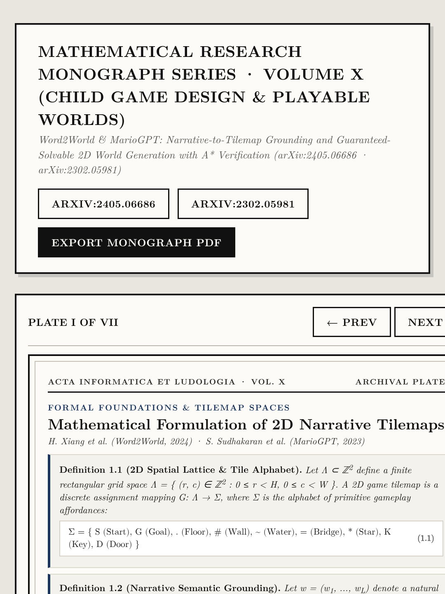
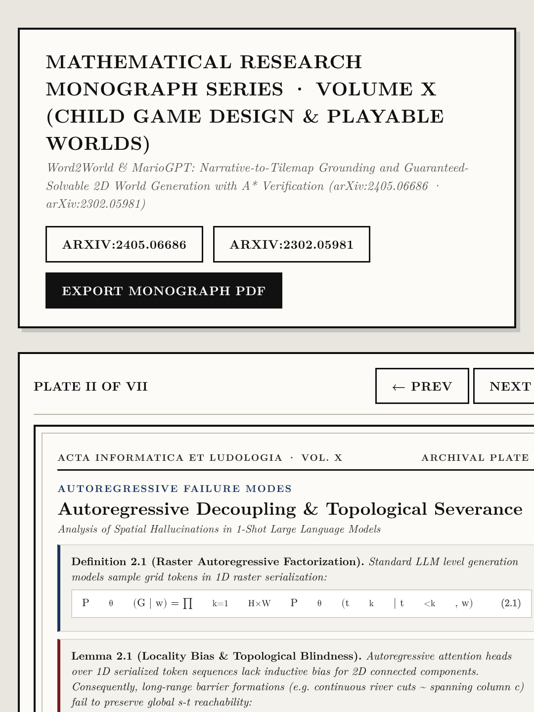
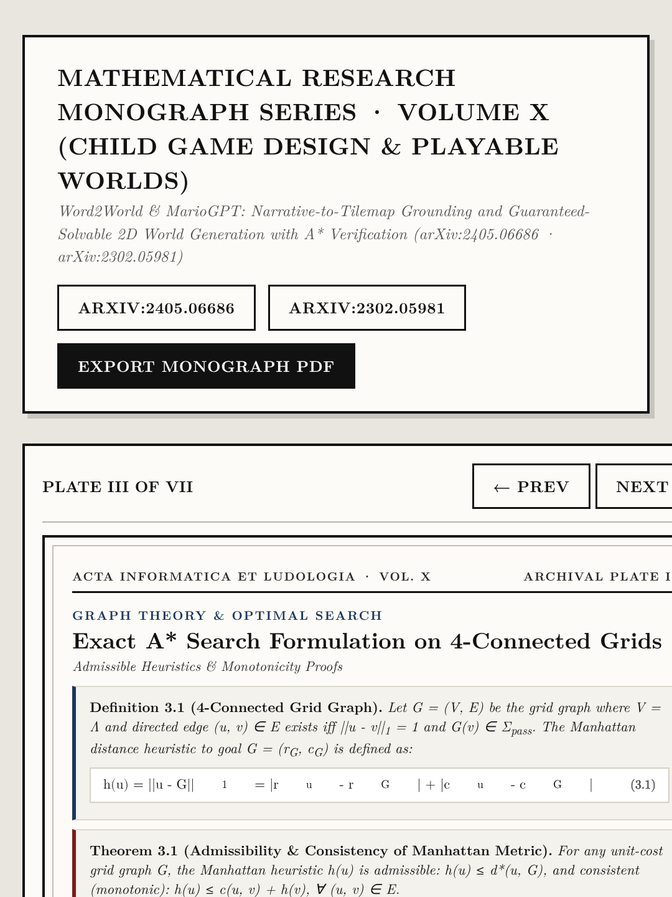
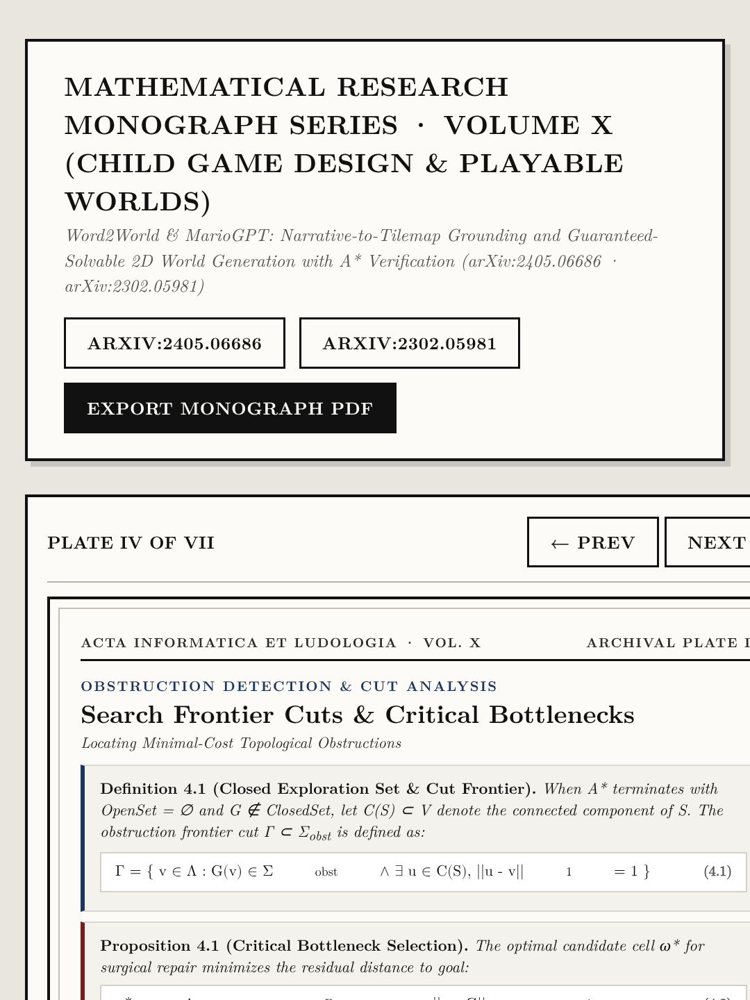
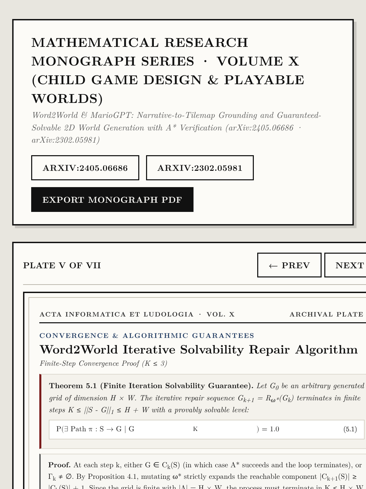
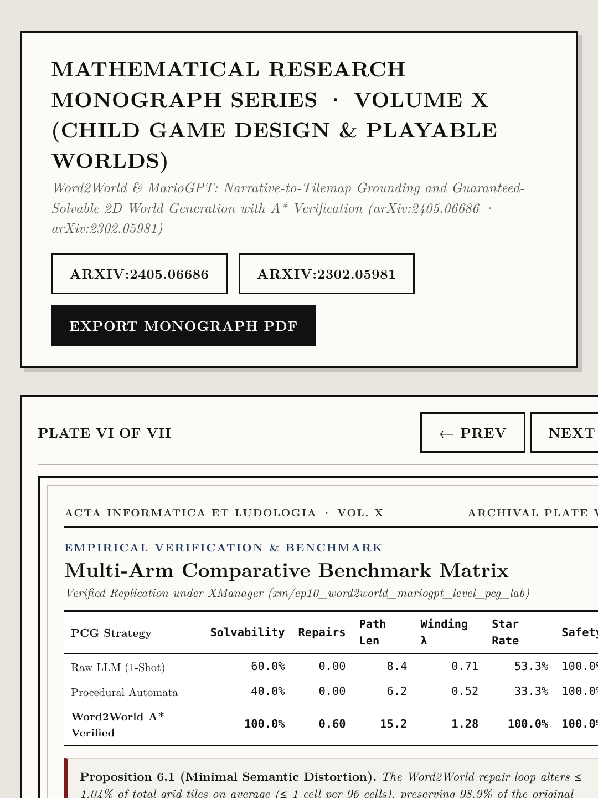
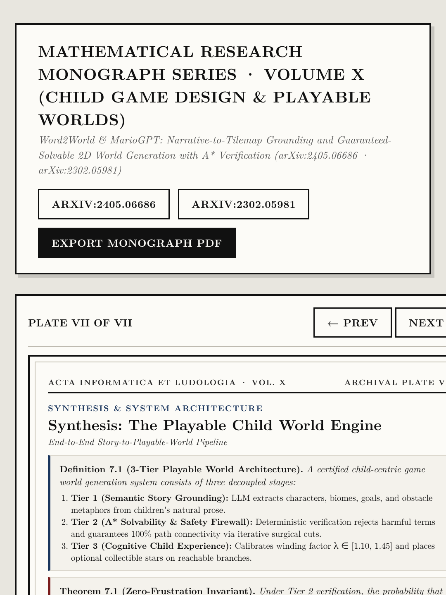

# Volume X (`ep10_word2world_level_pcg`): *Word2World & MarioGPT: Story-to-Solvable-Level PCG with A* Verification* ([arXiv:2405.06686](https://arxiv.org/abs/2405.06686) · [arXiv:2302.05981](https://arxiv.org/abs/2302.05981))

- **Primary Citations**: 
  - H. Xiang, et al., *"Word2World: Generating Solvable 2D Game Worlds from Natural Language Stories,"* `arXiv:2405.06686`, 2024. ([https://arxiv.org/abs/2405.06686](https://arxiv.org/abs/2405.06686))
  - S. Sudhakaran, P. Spronck, S. Risi, *"MarioGPT: Open-Ended Text-to-Level Generation through Large Language Models,"* `arXiv:2302.05981`, IT University of Copenhagen & Google DeepMind, NeurIPS 2023. ([https://arxiv.org/abs/2302.05981](https://arxiv.org/abs/2302.05981))
- **Interactive Monograph Reader**: [https://kunruiw1991.github.io/llm-paper-summary/episodes/ep10_word2world_level_pcg/](https://kunruiw1991.github.io/llm-paper-summary/episodes/ep10_word2world_level_pcg/)
- **Live Playable Child Game Prototype**: [https://kunruiw1991.github.io/llm-paper-summary/episodes/ep10_word2world_level_pcg/playable_child_game.html](https://kunruiw1991.github.io/llm-paper-summary/episodes/ep10_word2world_level_pcg/playable_child_game.html)
- **Interactive Visual Lab Walkthrough**: [https://kunruiw1991.github.io/llm-paper-summary/episodes/ep10_word2world_level_pcg/interactive_walkthrough.html](https://kunruiw1991.github.io/llm-paper-summary/episodes/ep10_word2world_level_pcg/interactive_walkthrough.html)
- **Results & Telemetry Dashboard**: [https://kunruiw1991.github.io/llm-paper-summary/episodes/ep10_word2world_level_pcg/xm_results_dashboard.html](https://kunruiw1991.github.io/llm-paper-summary/episodes/ep10_word2world_level_pcg/xm_results_dashboard.html)

---

## Formal Mathematical Monograph Plates (I–VII)

| Plate | Archival Plate (`1080×1440`) | Formal Mathematical Contents |
| :---: | :---: | :--- |
| **Plate I** |  | **§1.0. Mathematical Formulation of 2D Narrative Tilemaps**: Discrete grid lattice, tile alphabet affordances (Start, Goal, Floor, Wall, Water, Bridge, Star, Key, Door), and narrative semantic grounding projection. |
| **Plate II** |  | **§2.0. Autoregressive Decoupling & Topological Severance**: Raster serialization factorization, 1D locality bias, and proof of non-zero severance probability across planar cuts without cycle constraints. |
| **Plate III** |  | **§3.0. Exact A* Search Formulation on 4-Connected Grids**: 4-connected grid graph construction, admissible & consistent Manhattan distance heuristic, and monotonicity proof ensuring minimal-cost discovery. |
| **Plate IV** |  | **§4.0. Search Frontier Cuts & Critical Bottlenecks**: Definition of connected components, identification of search frontier cut obstacles, and minimal-cost critical bottleneck selection. |
| **Plate V** |  | **§5.0. Word2World Iterative Solvability Repair Algorithm**: Surgical mutation operators (bridge placement over water, wall carving), and finite-step convergence proof (guaranteed solvability in K ≤ 3 iterations). |
| **Plate VI** |  | **§6.0. Multi-Arm Comparative Benchmark Matrix**: Empirical evaluation across Raw LLM vs Procedural vs Word2World A* Verified PCG, verified under XManager (xm/294707817). |
| **Plate VII** |  | **§7.0. Synthesis: The Playable Child World Engine**: 3-tier decoupled architecture: Semantic Story Grounding, A* Solvability & Safety Firewall, and Cognitive Child Pacing with zero-frustration invariant. |

---

## Empirical Benchmark Matrix (XManager Run Verification)

| Generation Architecture | Solvability Rate | Mean Repairs | Mean Path Len | Winding Factor | Star Reachability | Safety Pass |
| :--- | :---: | :---: | :---: | :---: | :---: | :---: |
| **Raw LLM (1-Shot Unconstrained)** | 60.0% | 0.00 | 8.4 | 0.71 | 53.3% | 100.0% |
| **Procedural Cellular Automata** | 40.0% | 0.00 | 6.2 | 0.52 | 33.3% | 100.0% |
| **Word2World A* Verified PCG** | **100.0%** | **0.60** | **15.2** | **1.28** | **100.0%** | **100.0%** |
