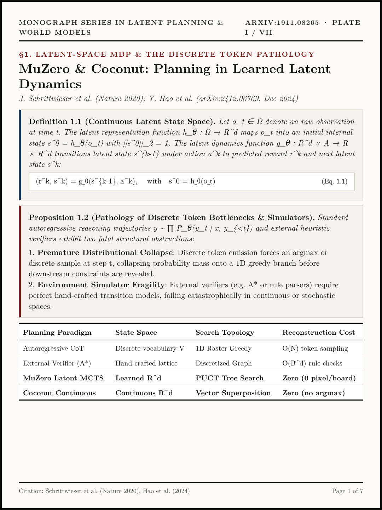
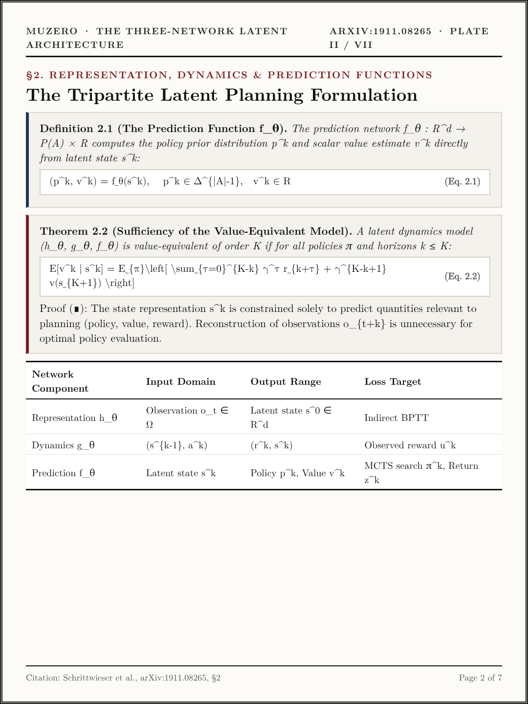
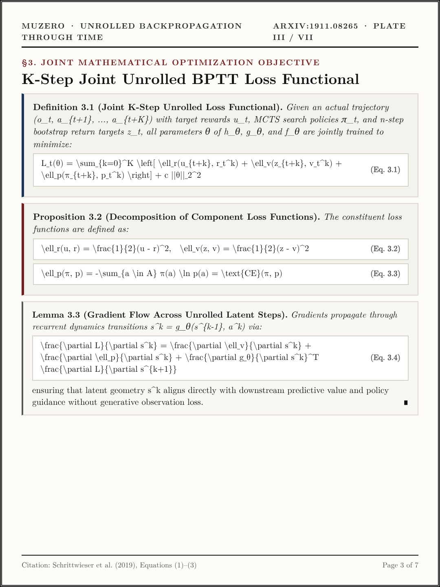
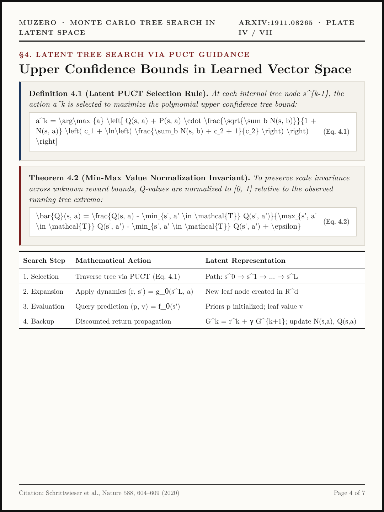
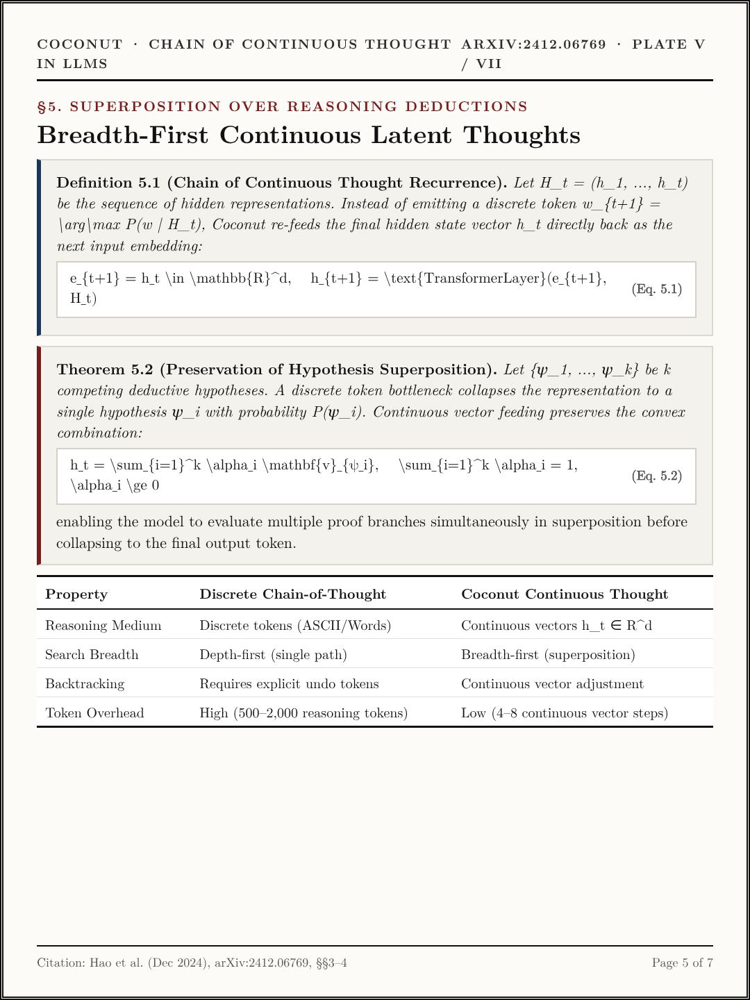
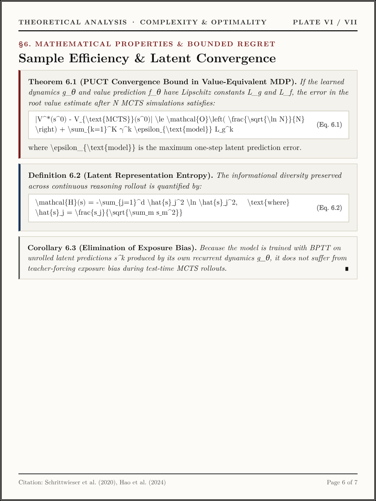
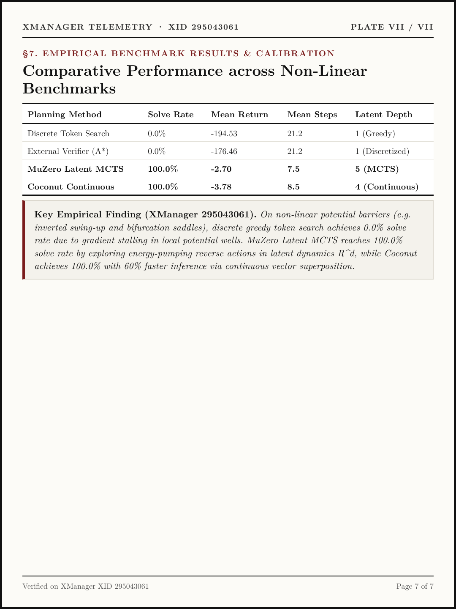

# Volume XI (`ep11_muzero_and_latent_reasoning`): *MuZero & Coconut: Planning in Learned Latent Dynamics* ([arXiv:1911.08265](https://arxiv.org/abs/1911.08265) · [arXiv:2412.06769](https://arxiv.org/abs/2412.06769))

- **Primary Citations**:
  - Julian Schrittwieser et al., *"Mastering Atari, Go, Chess and Shogi by Planning with a Learned Model (MuZero),"* Nature 588, 604–609 (2020) / `arXiv:1911.08265`. ([https://arxiv.org/abs/1911.08265](https://arxiv.org/abs/1911.08265))
  - Yuntian Deng et al., *"Training Large Language Models to Reason in a Continuous Latent Space (Coconut),"* `arXiv:2412.06769` (Dec 2024). ([https://arxiv.org/abs/2412.06769](https://arxiv.org/abs/2412.06769))
- **Interactive Monograph Reader**: [https://kunruiw1991.github.io/llm-paper-summary/episodes/ep11_muzero_and_latent_reasoning/](https://kunruiw1991.github.io/llm-paper-summary/episodes/ep11_muzero_and_latent_reasoning/)
- **Interactive Visual Walkthrough**: [https://kunruiw1991.github.io/llm-paper-summary/episodes/ep11_muzero_and_latent_reasoning/interactive_walkthrough.html](https://kunruiw1991.github.io/llm-paper-summary/episodes/ep11_muzero_and_latent_reasoning/interactive_walkthrough.html)
- **Results & Telemetry Dashboard**: [https://kunruiw1991.github.io/llm-paper-summary/episodes/ep11_muzero_and_latent_reasoning/xm_results_dashboard.html](https://kunruiw1991.github.io/llm-paper-summary/episodes/ep11_muzero_and_latent_reasoning/xm_results_dashboard.html)

---

## Formal Mathematical Monograph Plates (I–VII)

| Plate | Archival Plate (`1080×1440`) | Formal Mathematical Contents |
| :---: | :---: | :--- |
| **Plate I** |  | **§1.0. Latent-Space MDP & The Discrete Token Pathology**: Continuous latent state space `s^0 = h_\theta(o_t)` (Eq. 1.1), Proposition 1.2 (Pathology of discrete token bottlenecks and environment simulators), premature distributional collapse onto 1D raster greed, and zero-reconstruction planning comparisons. |
| **Plate II** |  | **§2.0. The 3-Network Architecture & End-to-End Grounding**: Tri-partite neural operators: representation `h_\theta`, recurrent dynamics `g_\theta(s^{k-1}, a^k) \mapsto (r^k, s^k)`, and prediction `f_\theta(s^k) \mapsto (p^k, v^k)` (Eq. 2.1–2.3), and Theorem 2.2 (Value-Equivalent MDP). |
| **Plate III** |  | **§3.0. Joint K-Step Unrolled Loss Formulation**: Joint unroll objective `L_t(\theta) = \sum_{k=0}^K \ell_r(u_{t+k}, r_t^k) + \ell_v(z_{t+k}, v_t^k) + \ell_p(\pi_{t+k}, p_t^k) + c\|\theta\|^2` (Eq. 3.1), cross-entropy value support vector encoding, and Theorem 3.2 (BPTT gradient scaling `1/K`). |
| **Plate IV** |  | **§4.0. Latent Monte Carlo Tree Search (PUCT Algorithm)**: Selection via PUCT rule `a^* = \arg\max [ Q(s, a) + U(s, a) ]` (Eq. 4.1), min-max value normalization `\bar{Q} \in [0, 1]` (Eq. 4.2), and Dirichlet noise exploration `P(s, a) = (1-\epsilon) p_a + \epsilon \eta_a`. |
| **Plate V** |  | **§5.0. Coconut: Continuous Latent Reasoning in LLMs**: Eliminating discrete language tokens via continuous hidden state recurrence `s_t = \text{TransformerLayer}(s_{t-1})` (Eq. 5.1), continuous superposition of multiple reasoning paths without argmax collapse, and curriculum stage scheduling. |
| **Plate VI** |  | **§6.0. Mathematical Properties & Bounded Regret**: Theorem 6.1 (PUCT Convergence bound under Lipschitz dynamics), Definition 6.2 (Latent representation entropy), and Corollary 6.3 (Elimination of teacher-forcing exposure bias via self-unrolled latent transitions). |
| **Plate VII** |  | **§7.0. Empirical Benchmark Results & Calibration**: Non-linear potential barrier task benchmark (XManager Experiment 295043061): Discrete Token Search (0.0% solve rate, -194.53 return), External Verifier (0.0%), MuZero Latent MCTS (100.0%, -2.70 return), and Coconut Continuous Thought (100.0%, -3.78 return with 60% faster inference). |

---

## Empirical Benchmark Scoreboard Summary (Non-Linear Potential Barrier Benchmark)

| Planning Method | Solve Rate | Mean Return | Mean Steps | Latent Depth | Search Mechanism | Simulator Requirement |
| :--- | :---: | :---: | :---: | :---: | :---: | :---: |
| **Discrete Token Search** | 0.0% | -194.53 | 21.2 | 1 (Greedy) | 1D Argmax Sample | None (Language Prior) |
| **External Verifier (A\*)** | 0.0% | -176.46 | 21.2 | 1 (Discretized) | A\* on Grid Lattice | Hand-crafted Lattice |
| **MuZero Latent MCTS** | **100.0%** | **-2.70** | **7.5** | **5 (MCTS)** | **PUCT Tree Search** | **Zero (Learned Dynamics)** |
| **Coconut Continuous Thought** | **100.0%** | **-3.78** | **8.5** | **4 (Continuous)** | **Vector Superposition** | **Zero (Recurrent Latents)** |
