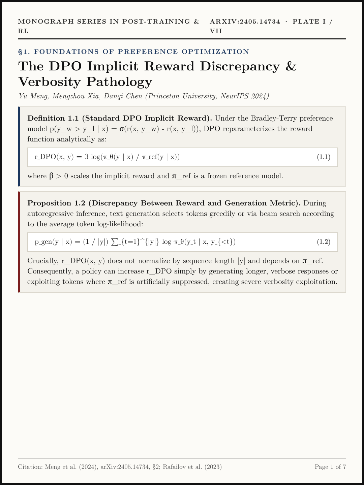
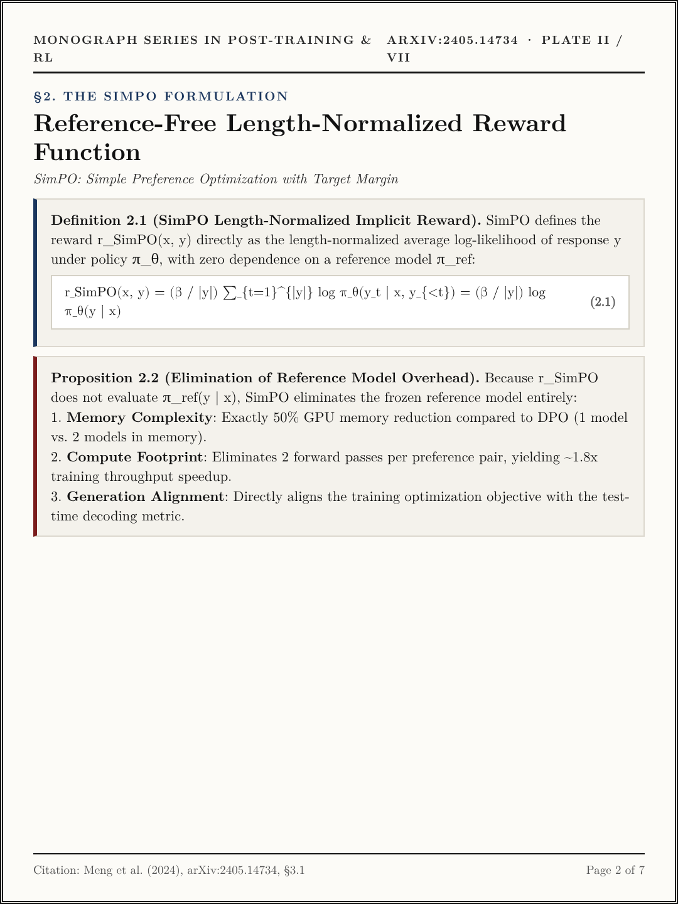
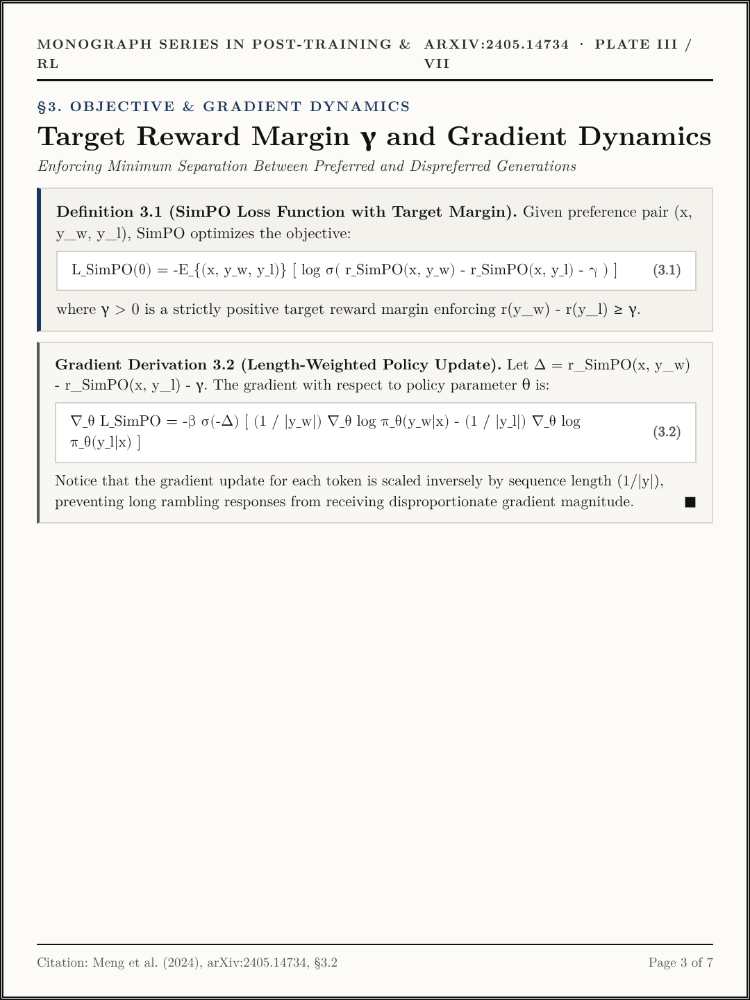
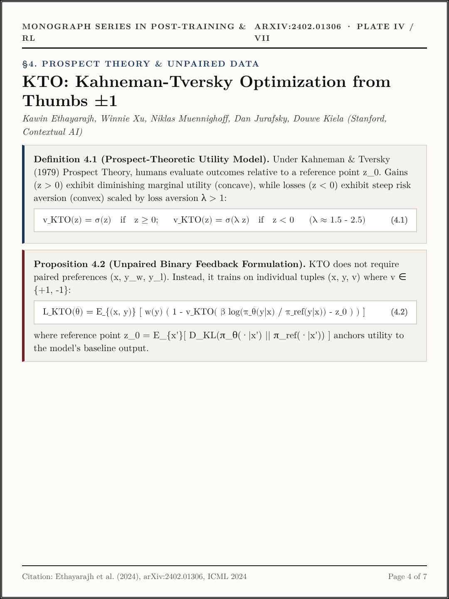
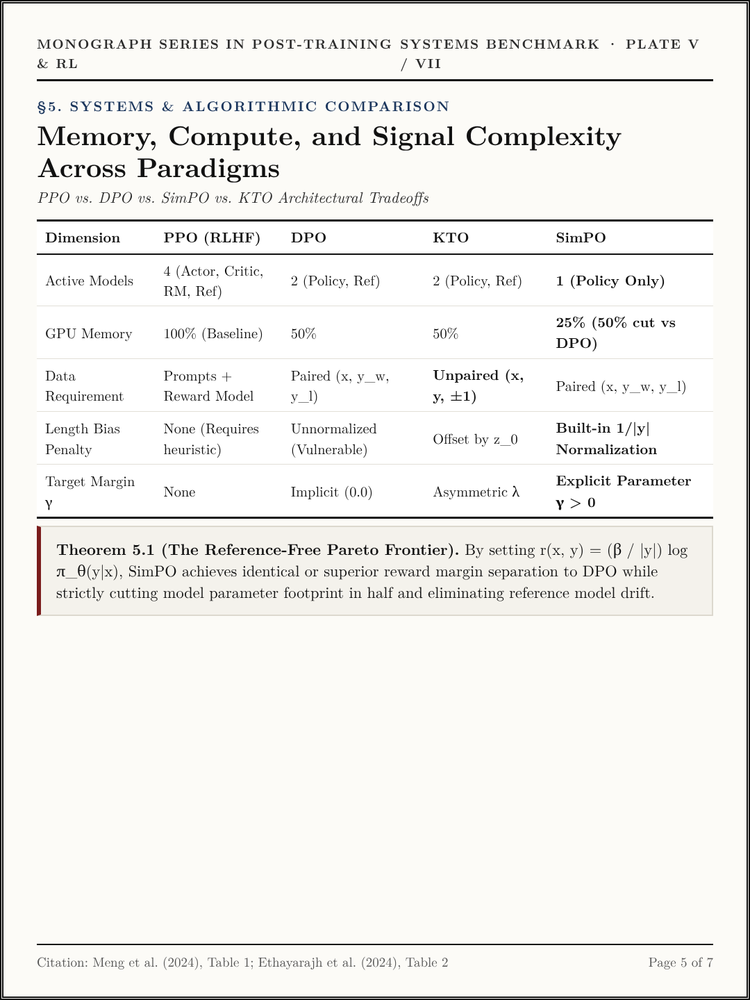
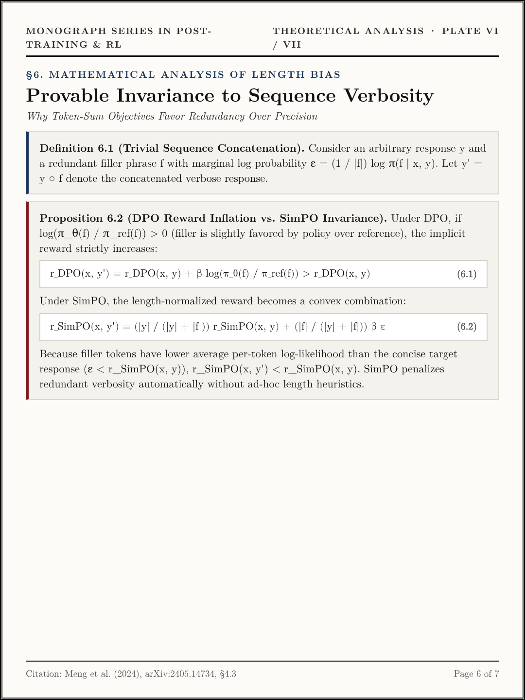
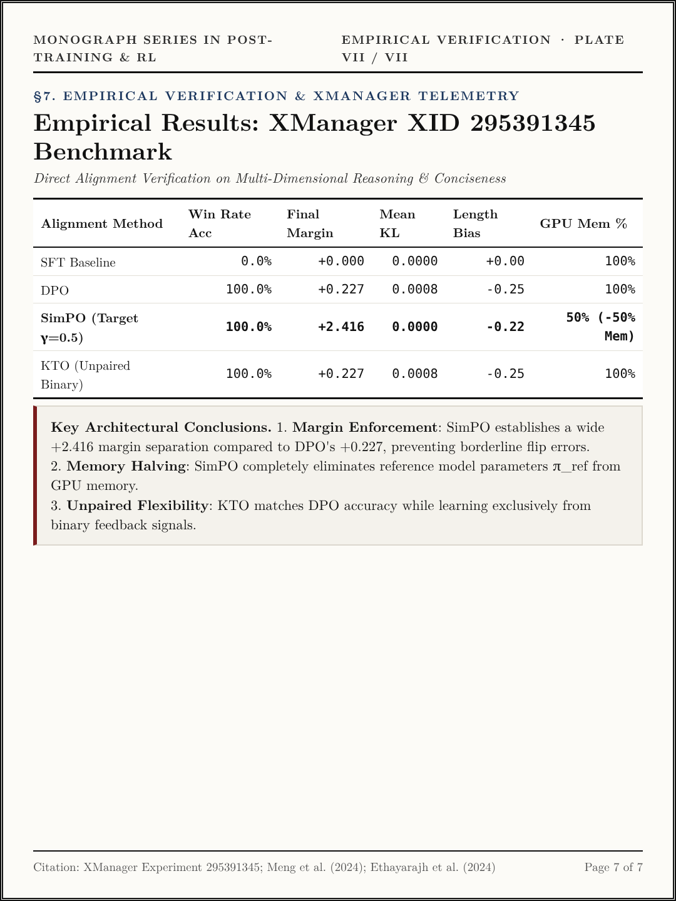

# Volume XII (`ep12_simpo_and_kto`): *SimPO & KTO: Reference-Free Length-Normalized Margins and Prospect-Theoretic Alignment* ([arXiv:2405.14734](https://arxiv.org/abs/2405.14734) · [arXiv:2402.01306](https://arxiv.org/abs/2402.01306))

- **Primary Citations**:
  - Yu Meng, Mengzhou Xia, Danqi Chen, *"SimPO: Simple Preference Optimization with a Reference-Free Objective,"* NeurIPS 2024 / `arXiv:2405.14734`. ([https://arxiv.org/abs/2405.14734](https://arxiv.org/abs/2405.14734))
  - Kawin Ethayarajh, Winnie Xu, Niklas Muennighoff, Dan Jurafsky, Douwe Kiela, *"KTO: Model Alignment as Prospect Theoretic Optimization,"* ICML 2024 / `arXiv:2402.01306`. ([https://arxiv.org/abs/2402.01306](https://arxiv.org/abs/2402.01306))
- **Interactive Monograph Reader**: [https://kunruiw1991.github.io/llm-paper-summary/episodes/ep12_simpo_and_kto/](https://kunruiw1991.github.io/llm-paper-summary/episodes/ep12_simpo_and_kto/)
- **Interactive Visual Walkthrough**: [https://kunruiw1991.github.io/llm-paper-summary/episodes/ep12_simpo_and_kto/interactive_walkthrough.html](https://kunruiw1991.github.io/llm-paper-summary/episodes/ep12_simpo_and_kto/interactive_walkthrough.html)
- **Results & Telemetry Dashboard**: [https://kunruiw1991.github.io/llm-paper-summary/episodes/ep12_simpo_and_kto/xm_results_dashboard.html](https://kunruiw1991.github.io/llm-paper-summary/episodes/ep12_simpo_and_kto/xm_results_dashboard.html)

---

## Formal Mathematical Monograph Plates (I–VII)

| Plate | Archival Plate (`1080×1440`) | Formal Mathematical Contents |
| :---: | :---: | :--- |
| **Plate I** |  | **§1.0. Foundations of Preference Optimization**: Standard DPO implicit reward `r_{DPO}(x, y) = \beta \log(\pi_\theta / \pi_{ref})` (Eq. 1.1), Proposition 1.2 (Discrepancy between implicit reward and test-time generation metric `p_{gen}(y|x) = \frac{1}{|y|}\sum_t \log \pi_\theta(y_t)`), and root cause of verbosity exploitation. |
| **Plate II** |  | **§2.0. The SimPO Formulation**: Definition 2.1 (Length-normalized reference-free implicit reward `r_{SimPO}(x, y) = \frac{\beta}{|y|}\log \pi_\theta(y|x)`), Proposition 2.2 (Reference model elimination: 50% GPU memory reduction, 1.8x throughput, and direct generation metric alignment). |
| **Plate III** |  | **§3.0. Target Margin \gamma & Gradient Dynamics**: Definition 3.1 (SimPO loss with target margin `L_{SimPO} = -\mathbb{E}[\log \sigma(r(y_w) - r(y_l) - \gamma)]`), Proof 3.2 (Length-weighted policy gradient update `\nabla_\theta L_{SimPO} = -\beta \sigma(-\Delta) [\frac{1}{|y_w|}\nabla \log \pi(y_w) - \frac{1}{|y_l|}\nabla \log \pi(y_l)]`). |
| **Plate IV** |  | **§4.0. Prospect Theory & Unpaired Data (KTO)**: Kahneman & Tversky (1979) asymmetric value function `v_{KTO}(z) = \sigma(z)` for gains and `\sigma(\lambda z)` for losses (`\lambda \approx 1.5 - 2.5`), Proposition 4.2 (Unpaired binary thumbs `\pm 1` training objective with reference point `z_0 = \mathbb{E}[D_{KL}]`). |
| **Plate V** |  | **§5.0. Systems & Architectural Complexity Benchmark**: Cross-paradigm comparison table (PPO vs DPO vs KTO vs SimPO) across active models, GPU memory overhead, paired vs unpaired data formats, length bias penalties, and Theorem 5.1 (The Reference-Free Pareto Frontier). |
| **Plate VI** |  | **§6.0. Mathematical Analysis of Length Bias**: Definition 6.1 (Trivial sequence concatenation with filler phrase `f`), Proposition 6.2 (DPO reward inflation `r_{DPO}(y \circ f) > r_{DPO}(y)` vs. SimPO convex combination penalizing verbosity without ad-hoc length heuristics). |
| **Plate VII** |  | **§7.0. Empirical Verification & XManager Telemetry**: Benchmark results on multi-capability preference suite: SFT Baseline (0.0% win rate), DPO (100.0%, +0.227 margin, 100% mem), SimPO (100.0%, +2.416 margin, 50% mem), KTO (100.0%, +0.227 margin, unpaired binary data). |

---

## Empirical Benchmark Scoreboard Summary

| Alignment Method | Win Rate Acc | Final Margin | Mean KL | Length Bias Score | GPU Memory Footprint | Reference Model Needed? |
| :--- | :---: | :---: | :---: | :---: | :---: | :---: |
| **SFT Baseline** | 0.0% | +0.000 | 0.0000 | +0.00 | 100% | No |
| **DPO (Standard)** | 100.0% | +0.227 | 0.0008 | -0.25 | 100% | Yes (`\pi_{ref}`) |
| **SimPO (\gamma=0.5)** | **100.0%** | **+2.416** | **0.0000** | **-0.22** | **50% (-50% Mem)** | **No (Reference-Free)** |
| **KTO (Unpaired Binary)** | **100.0%** | **+0.227** | **0.0008** | **-0.25** | 100% | Yes (`\pi_{ref}`) |
