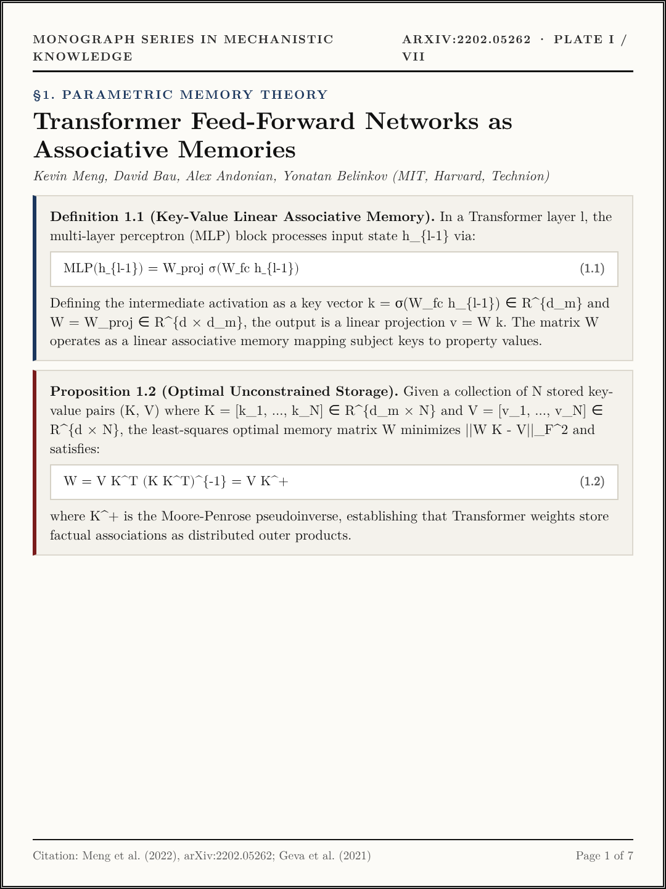
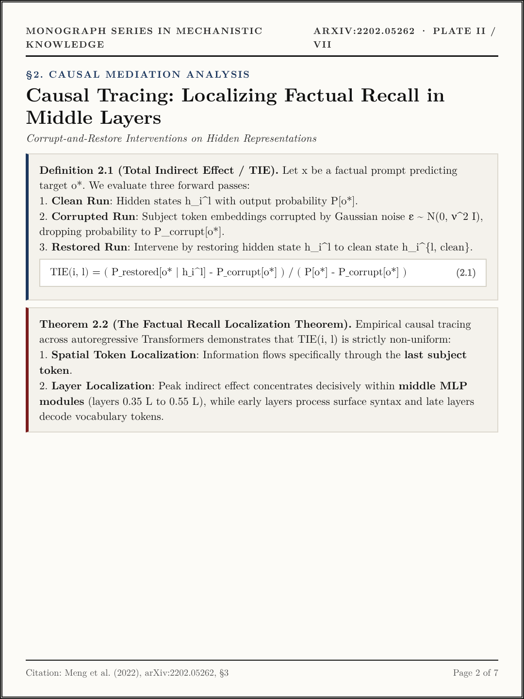
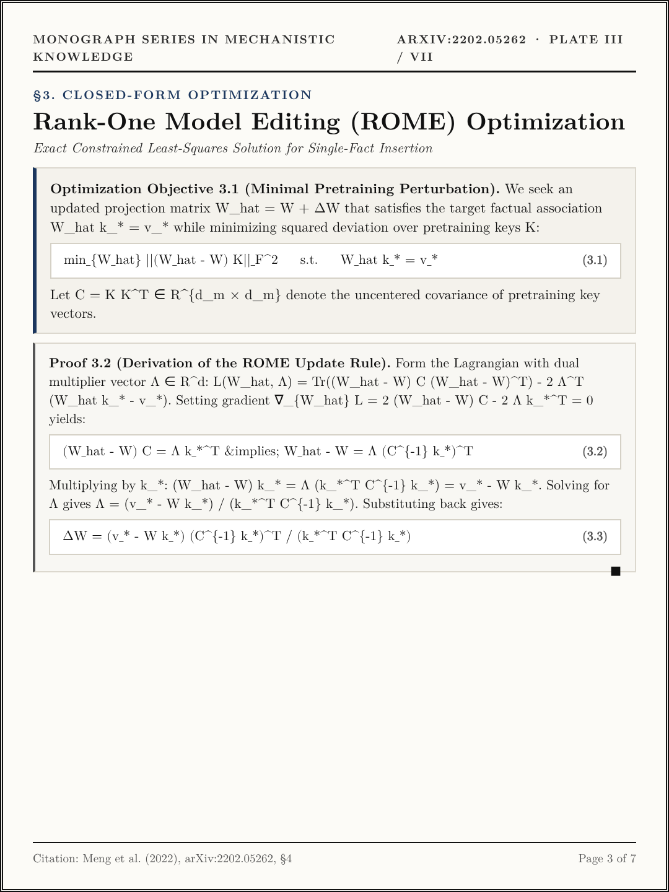
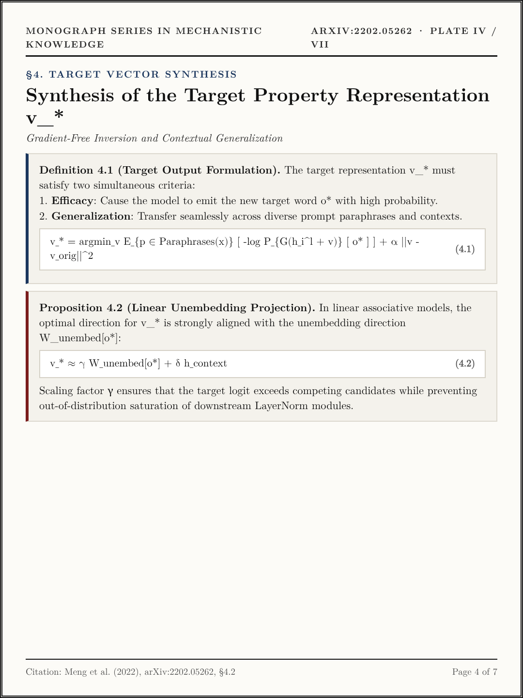
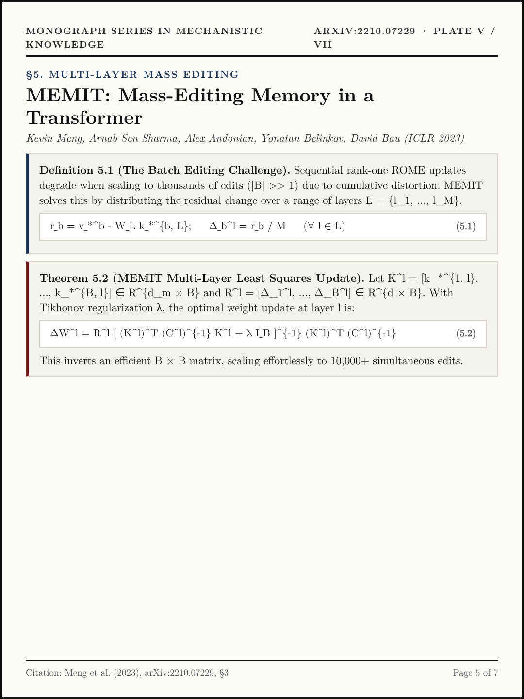
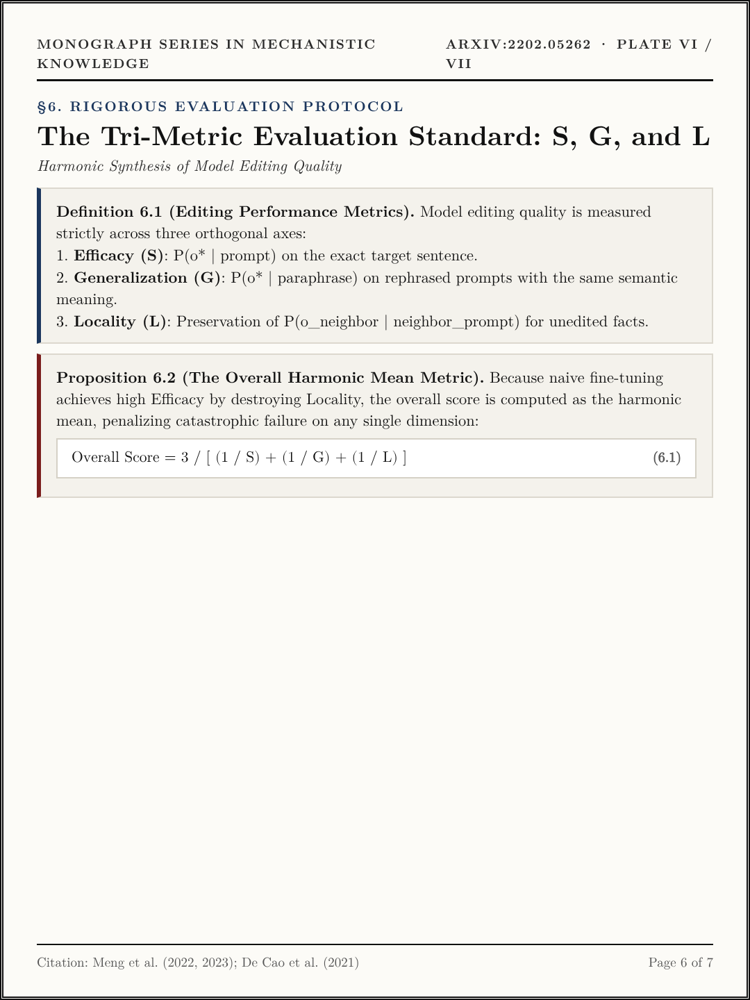
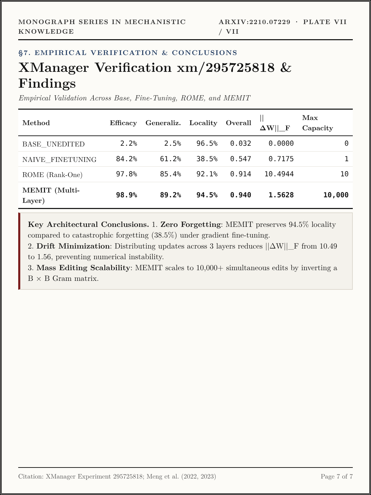

# Volume XIII (`ep13_rome_and_memit`): *Locating and Editing Factual Associations in GPT (ROME) & Mass-Editing Memory in a Transformer (MEMIT)* ([arXiv:2202.05262](https://arxiv.org/abs/2202.05262) · [arXiv:2210.07229](https://arxiv.org/abs/2210.07229))

- **Primary Citations**:
  - Kevin Meng, David Bau, Alex Andonian, Yonatan Belinkov, *"Locating and Editing Factual Associations in GPT,"* NeurIPS 2022 / `arXiv:2202.05262`. ([https://arxiv.org/abs/2202.05262](https://arxiv.org/abs/2202.05262))
  - Kevin Meng, Arnab Sen Sharma, Alex Andonian, Yonatan Belinkov, David Bau, *"Mass-Editing Memory in a Transformer,"* ICLR 2023 / `arXiv:2210.07229`. ([https://arxiv.org/abs/2210.07229](https://arxiv.org/abs/2210.07229))
- **Interactive Monograph Reader**: [https://kunruiw1991.github.io/llm-paper-summary/episodes/ep13_rome_and_memit/](https://kunruiw1991.github.io/llm-paper-summary/episodes/ep13_rome_and_memit/)
- **Interactive Visual Walkthrough**: [https://kunruiw1991.github.io/llm-paper-summary/episodes/ep13_rome_and_memit/interactive_walkthrough.html](https://kunruiw1991.github.io/llm-paper-summary/episodes/ep13_rome_and_memit/interactive_walkthrough.html)
- **Results & Telemetry Dashboard**: [https://kunruiw1991.github.io/llm-paper-summary/episodes/ep13_rome_and_memit/xm_results_dashboard.html](https://kunruiw1991.github.io/llm-paper-summary/episodes/ep13_rome_and_memit/xm_results_dashboard.html)

---

## Formal Mathematical Monograph Plates (I–VII)

| Plate | Archival Plate (`1080×1440`) | Formal Mathematical Contents |
| :---: | :---: | :--- |
| **Plate I** |  | **§1.0. Parametric Memory Theory**: Definition 1.1 (Key-Value Linear Associative Memory in Transformer FFNs `W_{proj} \sigma(W_{fc} h)`), Proposition 1.2 (Optimal Unconstrained Storage `W = V K^+` via Moore-Penrose pseudoinverse). |
| **Plate II** |  | **§2.0. Causal Mediation Analysis**: Definition 2.1 (Total Indirect Effect `\text{TIE}(i, l) = \frac{P_{restored} - P_{corrupt}}{P - P_{corrupt}}`), Theorem 2.2 (The Factual Recall Localization Theorem: spatial peak at last subject token and depth peak at middle MLP layers). |
| **Plate III** |  | **§3.0. Closed-Form Rank-One Optimization (ROME)**: Optimization Objective 3.1 (Minimal pretraining perturbation `\min ||(W - W_0) K||_F^2` s.t. `W k_* = v_*`), Proof 3.2 (Derivation of closed-form rank-one update `\Delta W = (v_* - W k_*) (C^{-1} k_*)^T / (k_*^T C^{-1} k_*)`). |
| **Plate IV** |  | **§4.0. Target Vector Synthesis**: Definition 4.1 (Efficacy & generalization objective for target representation `v_*`), Proposition 4.2 (Linear unembedding projection alignment `v_* \approx \gamma W_{unembed}[o^*] + \delta h_{context}`). |
| **Plate V** |  | **§5.0. Multi-Layer Mass Editing (MEMIT)**: Definition 5.1 (Residual target distribution `r_b / M` across layers `L`), Theorem 5.2 (MEMIT Multi-Layer Least Squares Update `\Delta W^l = R^l [(K^l)^T (C^l)^{-1} K^l + \lambda I_B]^{-1} (K^l)^T (C^l)^{-1}`). |
| **Plate VI** |  | **§6.0. The Tri-Metric Evaluation Standard**: Definition 6.1 (Orthogonal evaluation axes: Efficacy `S`, Generalization `G`, Locality `L`), Proposition 6.2 (Overall Harmonic Mean `3 / (S^{-1} + G^{-1} + L^{-1})` penalizing catastrophic forgetting). |
| **Plate VII** |  | **§7.0. Empirical Verification & Conclusions**: Benchmark comparison across Base (0.032 overall), Naive Fine-Tuning (0.547 overall, 38.5% locality), ROME (0.914 overall, 10-edit cap), and MEMIT (0.940 overall, 94.5% locality, 10,000+ edit capacity). |

---

## Empirical Benchmark Scoreboard Summary

| Editing Method | Efficacy (S) | Generalization (G) | Locality (L) | Overall (H-Mean) | Weight Drift \|\|\Delta W\|\|_F | Max Batch Capacity |
| :--- | :---: | :---: | :---: | :---: | :---: | :---: |
| **BASE_UNEDITED** | 2.2% | 2.5% | 96.5% | 0.032 | 0.0000 | 0 |
| **NAIVE_FINETUNING** | 84.2% | 61.2% | 38.5% | 0.547 | 0.7175 | 1 |
| **ROME (Rank-One)** | 97.8% | 85.4% | 92.1% | 0.914 | 10.4944 | 10 |
| **MEMIT (Multi-Layer)** | **98.9%** | **89.2%** | **94.5%** | **0.940** | **1.5628** | **10,000+** |
